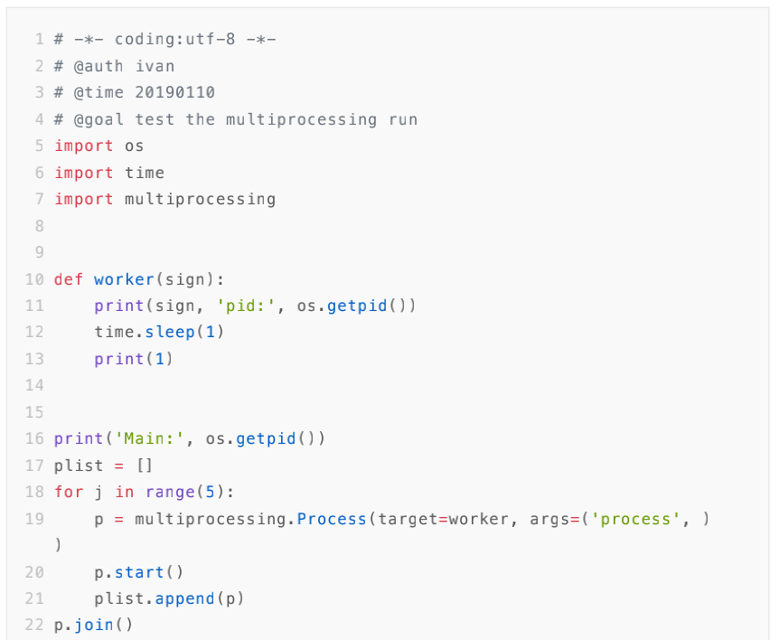

- [1.3.1 Python之禅](#131-python之禅)
- [1.3.2 Python教程](#132-python教程)
  - [1.3.2.1 小节摘要](#1321-小节摘要)
  - [1.3.2.2 四大任务](#1322-四大任务)
- [1.3.3 Python书籍](#133-python书籍)
- [1.3.4 Python Help使用](#134-python-help使用)
- [1.3.5 Python包](#135-python包)
  - [1.3.5.1 Python包缺失](#1351-python包缺失)
  - [1.3.5.2 Python包安装](#1352-python包安装)
  - [1.3.5.3 Python包验证](#1353-python包验证)
- [1.3.6 Python IDE](#136-python-ide)
  - [1.3.6.1 Jupyter](#1361-jupyter)
  - [1.3.6.2 Pycharm](#1362-pycharm)
- [1.3.7 Python代码规范](#137-python代码规范)
  - [1.3.7.1 PEP 8](#1371-pep-8)
  - [1.3.7.2 YAPF](#1372-yapf)
- [1.3.8 Python片段](#138-python片段)
- [1.3.9 Python编译](#139-python编译)

### 1.3.1 Python之禅
```python
import this
"""
The Zen of Python, by Tim Peters

Beautiful is better than ugly.
Explicit is better than implicit.
Simple is better than complex.
Complex is better than complicated.
Flat is better than nested.
Sparse is better than dense.
Readability counts.
Special cases aren't special enough to break the rules.
Although practicality beats purity.
Errors should never pass silently.
Unless explicitly silenced.
In the face of ambiguity, refuse the temptation to guess.
There should be one-- and preferably only one --obvious way to do it.
Although that way may not be obvious at first unless you're Dutch.
Now is better than never.
Although never is often better than *right* now.
If the implementation is hard to explain, it's a bad idea.
If the implementation is easy to explain, it may be a good idea.
Namespaces are one honking great idea -- let's do more of those!
"""

"""
•优美胜于丑陋(Python 以编写优美的代码为目标)
•明了胜于晦涩(优美的代码应当是明了的，命名规范，风格相似)
•简洁胜于复杂(优美的代码应当是简洁的，不要有复杂的内部实现)
•复杂胜于凌乱(如果复杂不可避免，那代码间也不能有难懂的关系，要保持接口简洁)
•扁平胜于嵌套(优美的代码应当是扁平的，不能有太多的嵌套)
•间隔胜于紧凑(优美的代码有适当的间隔，不要奢望一行代码解决问题)
•可读性很重要(优美的代码是可读的)
•即便假借特例的实用性之名，也不可违背这些规则(这些规则至高无上)
•不要包容所有错误，除非你确定需要这样做(精准地捕获异常，不写 except:pass 风格的代码)
•当存在多种可能，不要尝试去猜测
•而是尽量找一种，最好是唯一一种明显的解决方案(如果不确定，就用穷举法)
•虽然这并不容易，因为你不是 Python 之父(这里的 Dutch 是指 Guido )
•做也许好过不做，但不假思索就动手还不如不做(动手之前要细思量)
•如果你无法向人描述你的方案，那肯定不是一个好方案；反之亦然(方案测评标准)
•命名空间是一种绝妙的理念，我们应当多加利用(倡导与号召)
"""
```

### 1.3.2 Python教程
来自阿里的Python训练营(2020.11)，178页，19小节，包含四大任务。12天，每天1小时即可学完。

> 天池龙珠计划之Python学习电子书_v0.0.2.pdf

#### 1.3.2.1 小节摘要

- Python介绍

```python
print("Hello Python.")
```

- 变量、运算符与数据类型

```python
num = "123"
print(int(num) + 123)
```

- 位运算

```python
print(~1, 1 & 0, 1 | 0, 1 ^ 0, 100 >> 1, 100 << 1, 1<< 2)
```

- 条件语句

```python
num = 123
if num > 10:
    print("1")
elif num > 20:
    print("2")
else:
    print("3")
```

- 循环语句

```python
passwdList = [str(i) for i in range(232, 421)]
valid = False
count = 3
while count > 0:
    password = input('enter password:')
    for item in passwdList:
        if password == item:
            valid = True
            break
    
    if not valid:
        print('invalid input')
        count -= 1
        continue
    else:
        break
```

- 异常处理

```python
try:
    print(1+"1")
except Exception as e:
    print(e)
finally:
    print("END")
```

- 元组

```python
[1, 2, 3], (1, 2, 3)
```

- 字符串

```python
print("%.4f" % int("123,2.3"[:-1].strip(".").split(",")[0][::-1]))
```

- 字典

```python
dit = {"name": "X", "age": 20}
```

- 集合

```python
basket = {'apple', 'orange', 'apple', 'pear', 'orange', 'banana'}
```

- 序列

```python
t = "ABC"
list(t), tuple(t), len(t), max(t), min(t)
```

- 函数与lambda表达式

```python
def f(x):
    return x+2

f = lambda x: x+2
```

- 类与对象

```python
class C(object):
    def __init__(self):
        self.__x = None

    def getx(self):
        return self.__x

    def setx(self, value):
        self.__x = value
    
    def delx(self):
        del self.__x
```

- 魔法方法

```python
def libs(n):
    a = 0
    b = 1
    while True:
        a, b = b, a + b
        if a > n:
            return 
        yield a
    
for each in libs(100):
    print(each, end=' ')
```

- 模块

```python
import hello
hello.hi()
```

- datetime模块

```python
import datetime
dt = datetime.datetime(year=2020, month=6, day=25, hour=11, minute=51, second=49)
s = dt.strftime("%Y/%m/%d %H:%M:%S")
print(s)
```

- 文件与文件系统

```python
with open("c001.py", "r") as f:
    for i in f:
        print(i)
```

- OS模块

```python
import os
for item in os.listdir():
    print(item)
```

- 序列化与反序列化

```python
import pickle
data = {"name": "X", "age": 20}

with open("dataFile.pkl", "wb") as f:
    pickle.dump(data, f, -1)

with open("dataFile.pkl", "rb") as f:
    print(pickle.load(f))
```

#### 1.3.2.2 四大任务

- Task1

Python基础知识介绍，包含变量、位运算、条件语句和异常处理；

- Task2

Python中的6大数据结构，包括列表、元组、字符串、字典、集合、序列；

- Task3

Python中的函数、lambda表达式、类与对象、魔法方法；

- Task4

数据分析实战项目，从0开始动手；

### 1.3.3 Python书籍
> [https://www.runoob.com/python/python-tutorial.html](https://www.runoob.com/python/python-tutorial.html)
> 
> [https://www.runoob.com/python3/python3-tutorial.html](https://www.runoob.com/python3/python3-tutorial.html)
> 
> [https://www.w3cschool.cn/pythonlearn/](https://www.w3cschool.cn/pythonlearn/)
> 
> [https://www.liaoxuefeng.com/wiki/1016959663602400](https://www.liaoxuefeng.com/wiki/1016959663602400)
> 
> 《Python学习手册》
> 
> 《Python语言及其应用》
> 
> 《像计算机科学家一样思考Python》
> 


### 1.3.4 Python Help使用
直接调用`help()`语句，如下：

```python
import this
help(this)
"""
Help on module this:

NAME
    this

MODULE REFERENCE
    https://docs.python.org/3.7/library/this
    
    The following documentation is automatically generated from the Python
    source files.  It may be incomplete, incorrect or include features that
    are considered implementation detail and may vary between Python
    implementations.  When in doubt, consult the module reference at the
    location listed above.

DATA
    c = 97
    d = {'A': 'N', 'B': 'O', 'C': 'P', 'D': 'Q', 'E': 'R', 'F': 'S', 'G': ...
    i = 25
    s = "Gur Mra bs Clguba, ol Gvz Crgref\n\nOrnhgvshy vf o...bar ubaxvat ...

FILE
    /python3/lib/python3.7/this.py
"""
```

或者

```python
def f(para1, para2):
    """Get the min one."""
    return min(para1, para2)
help(f)
"""
Help on function f in module __main__:

f(para1, para2)
    Get the min one.
"""
```

### 1.3.5 Python包
#### 1.3.5.1 Python包缺失
执行代码时报错如下：

```python
import data
"""
---------------------------------------------------------------------------
ModuleNotFoundError                       Traceback (most recent call last)
<ipython-input-1090-699327cd1cad> in <module>()
----> 1 import data

ModuleNotFoundError: No module named 'data'
"""
```

即缺失该data工具包。

#### 1.3.5.2 Python包安装
一般的，可以使用Anaconda进行Python库安装及管理，其中包括Conda、Python以及一大堆安装好的工具包，比如：numpy、pandas等。
> [https://mirror.tuna.tsinghua.edu.cn/help/anaconda/](https://mirror.tuna.tsinghua.edu.cn/help/anaconda/)

对于Anaconda未预装的Python包就需要自行安装，如下：

（1）在线安装
```bash
pip install data -i https://pypi.tuna.tsinghua.edu.cn/simple
```

对于较新版本，推荐使用：
```bash
python3 -m pip install data -i https://pypi.tuna.tsinghua.edu.cn/simple
```

若显示`Successfully installed XXX`即安装成功。
```python
"""
Looking in indexes: https://pypi.tuna.tsinghua.edu.cn/simple
Collecting data
  Using cached https://pypi.tuna.tsinghua.edu.cn/packages/ed/e9/623be82fac4250fc614741f5b1ead83d339794f94b19ac8665b6ea12ee05/data-0.4.tar.gz (7.0 kB)
...
Building wheels for collected packages: data
  Building wheel for data (setup.py) ... done
  Created wheel for data: filename=data-0.4-py3-none-any.whl size=7247 sha256=32a13cabc2205de95c0be8d38888b6642b602dca08e2951f4d3c200128c6ff9d
  Stored in directory: /pip/wheels/35/20/c4/885e3ce9b69e4852259f20fe1ee95b5d6eb7dcaafae23f4051
Successfully built data
Installing collected packages: data
Successfully installed data-0.4
"""
```

（2）离线安装
大部分时候，安装Python包的银行环境属于内网独立网段，我们可以预先download好Python包用于离线安装。

```python
pip download data
"""
Collecting data
  Downloading data-0.4.tar.gz (7.0 kB)
Collecting decorator
  Downloading decorator-4.4.2-py2.py3-none-any.whl (9.2 kB)
Collecting funcsigs
  Downloading funcsigs-1.0.2-py2.py3-none-any.whl (17 kB)
Collecting six
  Downloading six-1.15.0-py2.py3-none-any.whl (10 kB)
Saved ./data-0.4.tar.gz
Saved ./decorator-4.4.2-py2.py3-none-any.whl
Saved ./funcsigs-1.0.2-py2.py3-none-any.whl
Saved ./six-1.15.0-py2.py3-none-any.whl
Successfully downloaded data decorator funcsigs six
"""
```

可以看到连带依赖包也下载好，可以打包带走，带到另一个地方进行离线安装。
```bash
cd packages
pip install six-1.15.0-py2.py3-none-any.whl
```

（3）源码安装
这里注意到data下载后是压缩包`data-0.4.tar.gz`，此时需要源码安装。

```python
# 解压，手动解压也一样
tar -zxvf data-0.4.tar.gz 
"""
data-0.4/
data-0.4/setup.cfg
data-0.4/PKG-INFO
data-0.4/setup.py
data-0.4/README.rst
data-0.4/data.egg-info/
data-0.4/data.egg-info/top_level.txt
data-0.4/data.egg-info/requires.txt
data-0.4/data.egg-info/dependency_links.txt
data-0.4/data.egg-info/SOURCES.txt
data-0.4/data.egg-info/PKG-INFO
data-0.4/data/
data-0.4/data/decorators.py
data-0.4/data/__init__.py
"""

# 去到该路径
cd data-0.4

# Build
python setup.py build
"""
running build
running build_py
creating build
creating build/lib
creating build/lib/data
copying data/__init__.py -> build/lib/data
copying data/decorators.py -> build/lib/data
"""

# Install
python setup.py install
"""
running install
running bdist_egg
running egg_info
writing data.egg-info/PKG-INFO
writing dependency_links to data.egg-info/dependency_links.txt
writing requirements to data.egg-info/requires.txt
writing top-level names to data.egg-info/top_level.txt
reading manifest file 'data.egg-info/SOURCES.txt'
writing manifest file 'data.egg-info/SOURCES.txt'
installing library code to build/bdist.linux-x86_64/egg
running install_lib
running build_py
...
Using /usr/local/lib/python3.6/dist-packages
Finished processing dependencies for data==0.4
"""
```

（4）卸载管理

```python
pip uninstall data   
"""
Found existing installation: data 0.4
Uninstalling data-0.4:
  Would remove:
    /python3/lib/python3.7/site-packages/data-0.4.dist-info/*
    /python3/lib/python3.7/site-packages/data/*
Proceed (y/n)? y
  Successfully uninstalled data-0.4
"""
```

#### 1.3.5.3 Python包验证
如上，我们已经安装data包，验证之。

```python
python -c "import data"
```

若无输出即安装无误。

- **PS**：在Windows环境下，上述命令需先通过win+R，输入cmd调出**命令提示符**操作。
除切换路径时改用`cd /d D:\Python包`，其余一致

### 1.3.6 Python IDE
#### 1.3.6.1 Jupyter

- Jupyter魔法函数

所谓魔法函数，实际上是IPython预先定义好的具备特定功能的函数被收到Jupyter中使用。

```python
%lsmagic
"""
Available line magics:
%alias  
%alias_magic  
%autocall  
%automagic  
%autosave  
%bookmark  
%cat  
%cd  
%clear  
%colors  
%config  
%connect_info  
%cp  
%debug  
%dhist  
%dirs  
%doctest_mode  
%ed  
%edit  
%env  
%gui  
%hist  
%history  
%killbgscripts  
%ldir  
%less  
%lf  
%lk  
%ll  
%load  
%load_ext  
%loadpy  
%logoff  
%logon  
%logstart  
%logstate  
%logstop  
%ls  
%lsmagic  
%lx  
%macro  
%magic  
%man  
%matplotlib  
%mkdir  
%more  
%mv  
%notebook  
%page  
%pastebin  
%pdb  
%pdef  
%pdoc  
%pfile  
%pinfo  
%pinfo2  
%popd  
%pprint  
%precision  
%profile  
%prun  
%psearch  
%psource  
%pushd  
%pwd  
%pycat  
%pylab  
%qtconsole  
%quickref  
%recall  
%rehashx  
%reload_ext  
%rep  
%rerun  
%reset  
%reset_selective  
%rm  
%rmdir  
%run  
%save  
%sc  
%set_env  
%store  
%sx  
%system  
%tb  
%time  
%timeit  
%unalias  
%unload_ext  
%who  
%who_ls  
%whos  
%xdel  
%xmode

Available cell magics:
%%!  
%%HTML  
%%SVG  
%%bash  
%%capture  
%%debug  
%%file  
%%html  
%%javascript  
%%js  
%%latex  
%%markdown  
%%perl  
%%prun  
%%pypy  
%%python  
%%python2  
%%python3  
%%ruby  
%%script  
%%sh  
%%svg  
%%sx  
%%system  
%%time  
%%timeit  
%%writefile

Automagic is ON, % prefix IS NOT needed for line magics.
"""
```

常用的%time、%timeit，能为代码提供执行计时服务，区别在于%time返回单次结果，%timeit返回循环N轮次后统计结果。这很适合性能比拼，以下测试sum、np.sum在实现一样的求和功能时，代码耗时情况：

```python
import numpy as np
L = np.linspace(0, 100, 1000000)
f1 = lambda l: sum(l)
f2 = lambda l: np.sum(l)

%time f1(L)
%time f2(L)

%timeit f1(L)
%timeit f2(L)
"""
CPU times: user 132 ms, sys: 548 µs, total: 132 ms
Wall time: 133 ms
CPU times: user 810 µs, sys: 479 µs, total: 1.29 ms
Wall time: 1.16 ms

140 ms ± 3.3 ms per loop (mean ± std. dev. of 7 runs, 10 loops each)
367 µs ± 39.1 µs per loop (mean ± std. dev. of 7 runs, 1000 loops each)
"""
```

显然，此测试中np.sum完胜！

#### 1.3.6.2 Pycharm
虽然，Pycharm也集成了Jupyter的功能，相对而言，Pycharm比较适合开发工程型项目。

### 1.3.7 Python代码规范
一般来说，我们使用**PEP8**作为Python代码规范。
#### 1.3.7.1 PEP 8
> [https://www.python.org/dev/peps/pep-0008/](https://www.python.org/dev/peps/pep-0008/)
> [https://github.com/python/peps/blob/master/pep-0008.txt](https://github.com/python/peps/blob/master/pep-0008.txt)


要求如：

- Use 4 spaces per indentation level.
- Limit all lines to a maximum of 79 characters.
- ...

#### 1.3.7.2 YAPF
可以使用Google开发的格式工具YAPF。
> [https://github.com/google/yapf](https://github.com/google/yapf)
> [https://pypi.org/project/yapf/](https://pypi.org/project/yapf/)


（1）安装

```shell
pip install yapf
```

（2）说明

```python
yapf --help
"""
usage: yapf [-h] [-v] [-d | -i] [-r | -l START-END] [-e PATTERN]
            [--style STYLE] [--style-help] [--no-local-style] [-p]
            [-vv]
            [files [files ...]]

Formatter for Python code.

positional arguments:
  files

optional arguments:
  -h, --help            show this help message and exit
  -v, --version         show version number and exit
  -d, --diff            print the diff for the fixed source
  -i, --in-place        make changes to files in place
  -r, --recursive       run recursively over directories
  -l START-END, --lines START-END
                        range of lines to reformat, one-based
  -e PATTERN, --exclude PATTERN
                        patterns for files to exclude from formatting
  --style STYLE         specify formatting style: either a style name (for
                        example "pep8" or "google"), or the name of a file
                        with style settings. The default is pep8 unless a
                        .style.yapf or setup.cfg file located in the same
                        directory as the source or one of its parent
                        directories (for stdin, the current directory is
                        used).
  --style-help          show style settings and exit; this output can be saved
                        to .style.yapf to make your settings permanent
  --no-local-style      don't search for local style definition
  -p, --parallel        Run yapf in parallel when formatting multiple files.
                        Requires concurrent.futures in Python 2.X
  -vv, --verbose        Print out file names while processing
 """
```

- 应用1
```shell
yapf -i run.py
```

- 应用2
```python
#
from yapf.yapflib.yapf_api import FormatCode
code = """
x = {  'a':37,'b':42,

'c':927}

y = 'hello ''world'
z = 'hello '+'world'
a = 'hello {}'.format('world')
class foo  (     object  ):
  def f    (self   ):
    return       37*-+2
  def g(self, x,y=42):
      return y
def f  (   a ) :
  return      37+-+a[42-x :  y**3]
"""

print(FormatCode(code))
"""
("x = {'a': 37, 'b': 42, 'c': 927}\n\ny = 'hello ' 'world'\nz = 'hello ' + 'world'\na = 'hello {}'.format('world')\n\n\nclass foo(object):\n    def f(self):\n        return 37 * -+2\n\n    def g(self, x, y=42):\n        return y\n\n\ndef f(a):\n    return 37 + -+a[42 - x:y**3]\n", True)
"""
```

（3）示例
以下例举官方例子。

修改前：

```python
x = {  'a':37,'b':42,

'c':927}

y = 'hello ''world'
z = 'hello '+'world'
a = 'hello {}'.format('world')
class foo  (     object  ):
  def f    (self   ):
    return       37*-+2
  def g(self, x,y=42):
      return y
def f  (   a ) :
  return      37+-+a[42-x :  y**3]
```

修改后：

```python
x = {'a': 37, 'b': 42, 'c': 927}

y = 'hello ' 'world'
z = 'hello ' + 'world'
a = 'hello {}'.format('world')


class foo(object):
    def f(self):
        return 37 * -+2

    def g(self, x, y=42):
        return y


def f(a):
    return 37 + -+a[42 - x:y**3]
```

### 1.3.8 Python片段

详见：

> https://github.com/IvanaXu/PyTools

示例，009.Test_multiprocessing_run, multiprocessing多线程

<p align="center">

</p>

### 1.3.9 Python编译

由于Python编译对大部分开发者是无感的，一般来说，我们不需要像SAS那样进一步延伸编译层的PDV概念，进而能编写出更加优质（但也更加难懂）的代码。故而以下只点出三个概念：

- 其一，基本编译

> Python每次运行都要进行转换成字节码，然后再有虚拟机把字节码转换成机器语言，最后才能在硬件上运行。与编译性语言相比，每次多出了编译和链接的过程，性能肯定会受到影响；而python并不是每次都需要转换字节码，解释器在转换之前会判断代码文件的修改时间是否与上一次转换后的字节码pyc文件的修改时间一致，若不一致才会重新转换。


- 其二，code object

我们可以通过内置函数compile，将源文件编译成code object，如下：

```python
cmd = """
print(1)
"""
code_object = compile(cmd, "", "exec")
print(code_object)
eval(code_object)

"""
<code object <module> at 0x7f859d1b79c0, file "", line 2>
1
"""
```

还可以通过dis进行反编译：

```python
import dis
dis.dis(code_object)
"""
2             0 LOAD_NAME                0 (print)
              2 LOAD_CONST               0 (1)
              4 CALL_FUNCTION            1
              6 POP_TOP
              8 LOAD_CONST               1 (None)
             10 RETURN_VALUE
"""
```

可以看到python字节码其实是模仿的x86的汇编，将代码编译成一条一条的指令交给一个虚拟的cpu去执行的。
> 有兴趣的同学可拓展学习：
> 
> [https://godbolt.org/](https://godbolt.org/)一个多语言在线编辑器
> 
> Python代码片段-081.Test_eval, eval的安全攻防
> 


- 其三，Python部署

这里指Python部署时，将Python转换Pyc/Pyo/So文件，避免直接暴露源码。

```shell
# 同一系统环境下

/python3/bin/cython run.py
# /python3/bin/python -m py_compile run.py

gcc -c -fPIC run.c

gcc -shared run.o -o run.so

```

