- [1.5.1 Excel技巧](#151-excel技巧)
  - [1.5.1.1 文件操作](#1511-文件操作)
  - [1.5.1.2 窗口设置](#1512-窗口设置)
  - [1.5.1.3 单元格显示](#1513-单元格显示)
  - [1.5.1.4 单元格选取](#1514-单元格选取)
  - [1.5.1.5 单元格编辑](#1515-单元格编辑)
  - [1.5.1.6 单元格格式设置](#1516-单元格格式设置)
  - [1.5.1.7 图片处理](#1517-图片处理)
  - [1.5.1.8 打印设置](#1518-打印设置)
- [1.5.2 Excel 数据透视表](#152-excel-数据透视表)
- [1.5.3 Excel-SAS控件](#153-excel-sas控件)

### 1.5.1 Excel技巧
#### 1.5.1.1 文件操作

（1）为excel文件添加打开密码

文件 - 信息 - 保护工作簿 - 用密码进行加密。

（2）为文件添加作者信息

在该excel文件图标上右键单击 - 属性 - 摘要 - 在作者栏中输入

（3）让多人通过局域网共用excel文件

审阅 - 共享工作簿 - 在打开的窗口上选中“允许多用户同时编辑...”

（4）同时打开多个excel文件

按ctrl或shift键选取多个要打开的excel文件，右键菜单中点“打开”

（5）同时关闭所有打开的excel文件

按shift键同时点右上角关闭按钮。

（6）设置文件自动保存时间

文件 - 选项 - 保存 - 设置保存间隔

（7）恢复未保护的excel文件

文件 - 最近所用文件 - 点击“恢复未保存的excel文件”

（8）在excel文件中创建日历

文件 - 新建 - 日历

（9）设置新建excel文件的默认字体和字号

文件 - 选项 - 常规 - 新建工作簿时：设置字号和字体

（10）把A.xlsx文件图标显示为图片形式

把A.xlsx 修改为 A.Jpg

（11）一键新建excel文件

Ctrl + N

（12）把工作表另存为excel文件

在工作表标签上右键 - 移动或复制 - 移动到”新工作簿”

#### 1.5.1.2 窗口设置

（1）同时打开对比两个或多个excel文件

视图 - 全部重排 - 选排列的方向

（2）同时查找一个工作簿中的两个工作表

视图 - 新建窗口 - 全部重排 - 选排列方向

（3）隐藏或显示excel最上面的功能区

Ctrl+F1

（4）隐藏excel工作表界面

选取要隐藏的工作表 - 视图 - 隐藏

（5）让标题行始终显示在最上面

视图 - 冻结窗格 - 冻结首行

（6）把窗口拆分成上下两部分，都可以上下翻看

选取要拆分的位置 - 视图 - 拆分

（7）调整excel工作表显示比例

按ctrl+滚轮

（8）快速切换到另一个excel窗口

ctrl + tab键

（9）全屏显示excel界面

视图 - 全屏显示

#### 1.5.1.3 单元格显示

（1）隐藏0值

文件 - 选项 - 高级 - 去掉“在具有零值.....”勾选

（2）隐藏单元格内所有值

ctrl+1打开单元格设置窗口 - 数字 - 自定义 - 右边文框中输入三个分号;;;

（3）隐藏编辑栏、灰色表格线、列标和行号

视图 - 显示 - 去掉 各项的勾选

#### 1.5.1.4 单元格选取

（1）选取当前表格

按ctrl+a全选当前数据区域

（2）选取表格中的值/公式

按ctrl+g打开定位窗口 - 定位条件 - 值/公式

（3）查找值

按ctrl+f打开查找窗口，输入查找的值 - 查找

（4）选取最下/最右边的非空单元格

按ctrl + 向下/向右箭头

（5）快速选取指定大小的区域

在左上的名称栏中输入单元格地址，如a1:a10000，然后按回车

#### 1.5.1.5 单元格编辑

（1）设置单元格按回车键光标跳转方向

文件 - 选项 - 高级 - 最上面“按Enter键后移动所选内容” - 设置方向

（2）设置下拉菜单，显示A,B,C三个选项

数据 - 数据有效性 - 允许 - 序列 - 输入A,B,C

（3）复制表格保存行高列宽不变

整行选取复制 - 粘贴后点粘贴选项中的“保留列宽”

（4）输入到F列时，自动转到下一行的首列

选取A:F列，输入后按回车即可自动跳转

（5）设置三栏表头

插入 - 形状 - 直线 - 拖入文本框中输入的字体并把边框设置为无

（6）同时编辑多个工作表

按ctrl或shift键选取多个工作表，直接编辑当前工作表即可。

（7）输入身份证号或以0开始的数字

把单元格格式设置成文本，然后再输入

（8）快速删除空行

选取表中某列 - ctrl+g定位 - 定位条件 - 空值 - 删除整行

（9）快速插入空行

在表右侧输入序号1,2,3..N,然后再复制该序号到下面空行，最后按序号列排序即可。

（10）快速合并多行数据

插入批注 - 选取多列数据复制 - 粘贴到批注中，然后再从批注中复制粘至单元格区域中即可。

（11）插入特殊符号

插入 - 符号

（12）查找重复值

选取数据列 - 开始 - 条件格式 - 突出显示单元格规则 - 重复值

（13）删除重复值

选取区域 - 数据 - 删除重复项

（14）单元格分区域需要密码才能编辑

审阅 - 允许用户编辑区域

（15）用excel进行汉英互译

审阅 - 翻释

（16）不复制隐藏的行

选取区域 - ctrl+g定位 - 定位条件 - 可见单元格 - 复制 - 粘贴

（17）单元格强制换行

在需要换行字符后按alt+enter键

#### 1.5.1.6 单元格格式设置

（1）万元显示

自定义格式代码：0“,"0,

（2）日期按年年年年-月月-日日显示

自定义格式代码：yyyy-mm-dd

（3）手机号分段显示

自定义格式代码：000 0000 0000

（4）数字1显示成1月

自定义格式代码: 0“月"

#### 1.5.1.7 图片处理

（1）删除工作表中所有图片

ctrl+g定位 - 定位条件 - 对象 - 删除

（2）工作表插入背景图片

页面布局 - 背景 - 选择插入图片

（3）插入可以打印的背景

插入 - 页眉页脚 - 选取页眉后点图片 - 选取图片并拖入

#### 1.5.1.8 打印设置

（1）打印标题行

页面布局 - 打印标题 - 点顶端标题行后的折叠按钮，选取要打印的标题行。

（2）多页强制打印到一页上

页面布局 - 打印标题 - 页面 - 调整为1页宽1页高

（3）按厘米设置行高

视图 - 页面布局，在页面布局下行高单位是厘米

（4）插入分页符

选取要插入的位置 - 页面布局 - 分页符 - 插入分页符

### 1.5.2 Excel 数据透视表

普及数据透视表概念，配合`PROC SUMMARY`，简直是数据分析利器，图有指出处。

  
  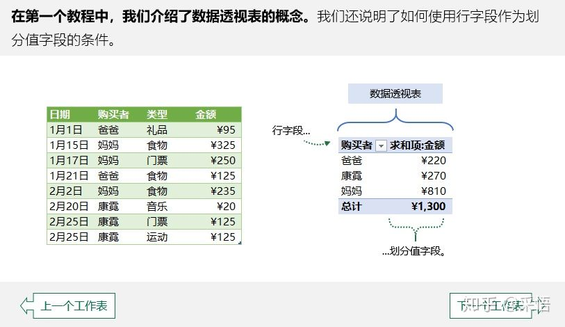
  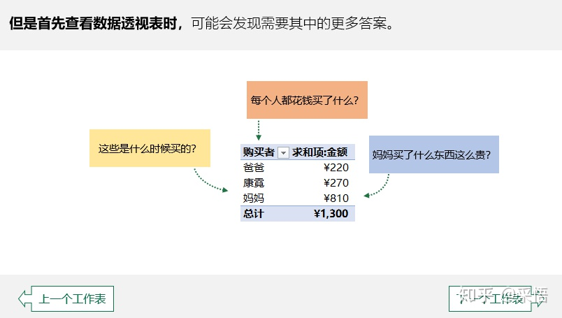
  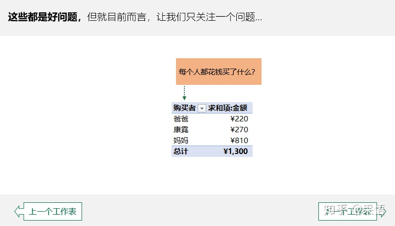
  
  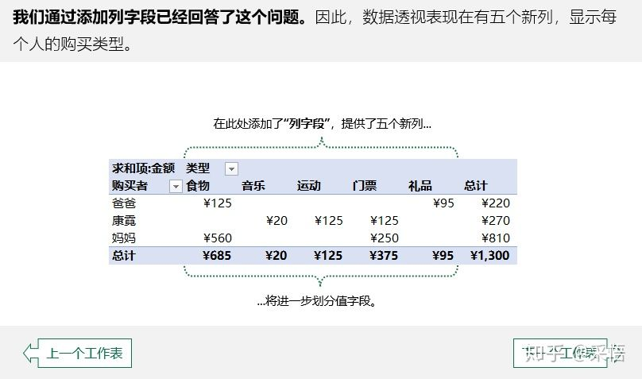
  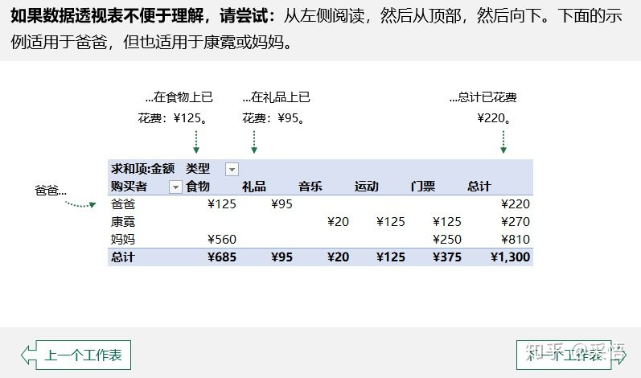
  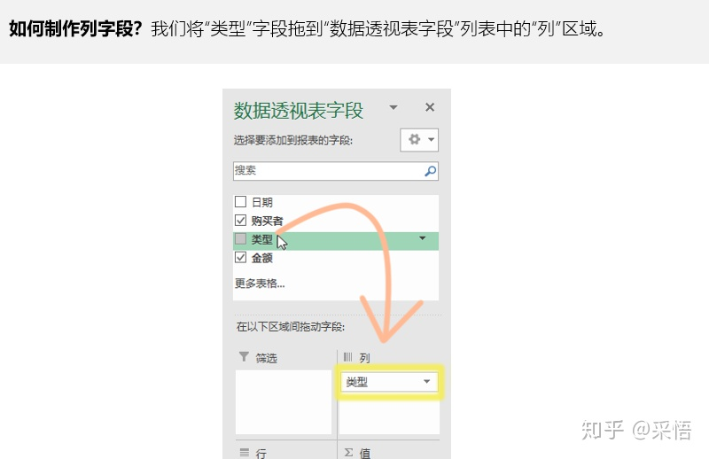
  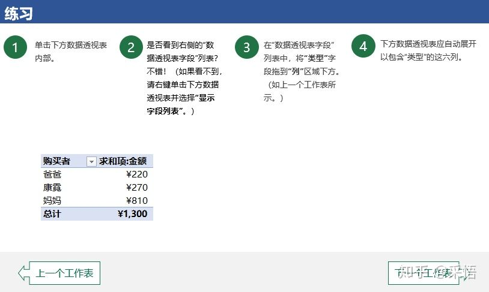
  
  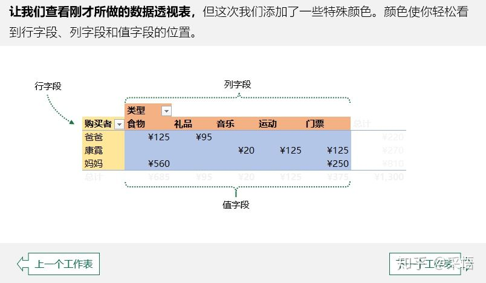
  
  
  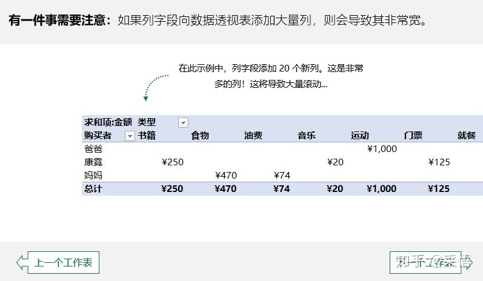
  
  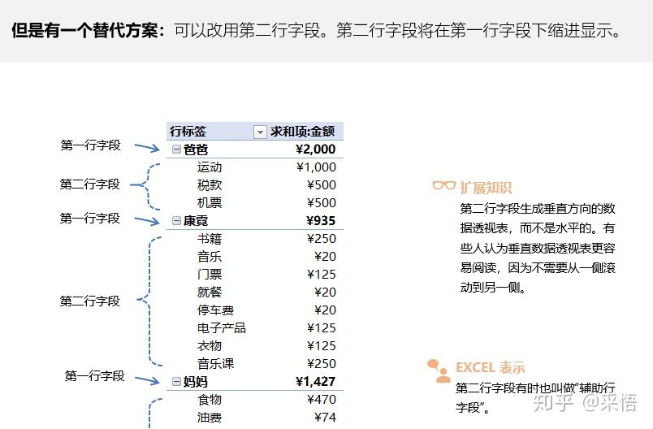
  
  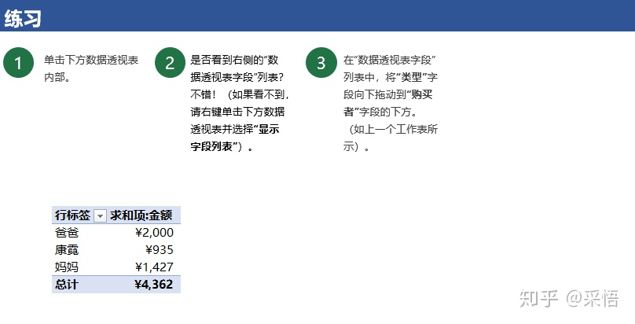
  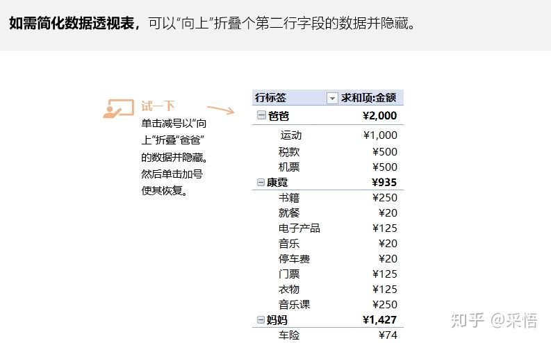
  
  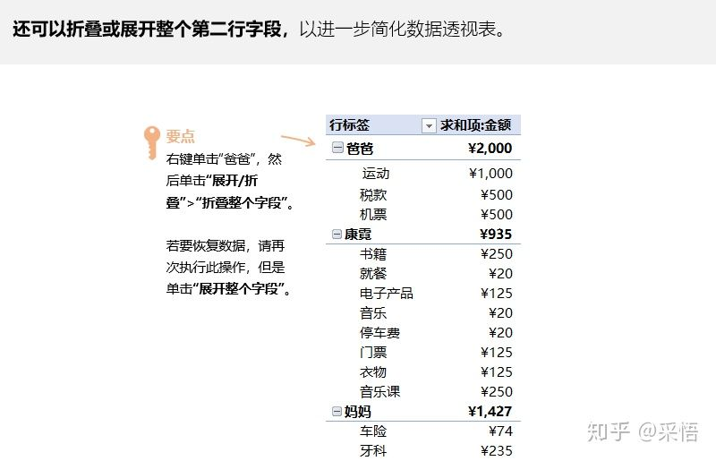
  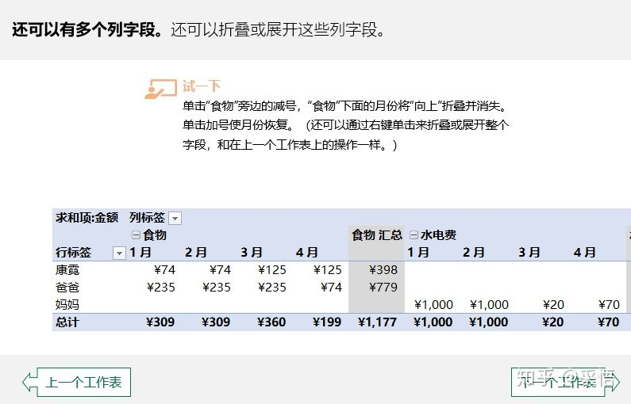
  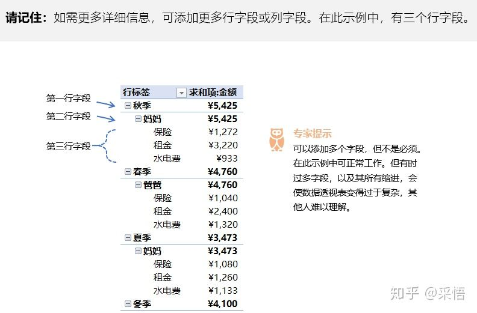
  

### 1.5.3 Excel-SAS控件

最后，随着Excel不断更新，如SAS控件、SMART-BI控件使Excel如虎添翼，以下会举例Excel-SAS控件。但值得注意的是，Power-BI、Tableu、SuperSet、Quick BI 等更强BI工具甚至分析工具的出现，这对Excel仍有不小的挑战，待持续关注吧。

- Excel-SAS控件

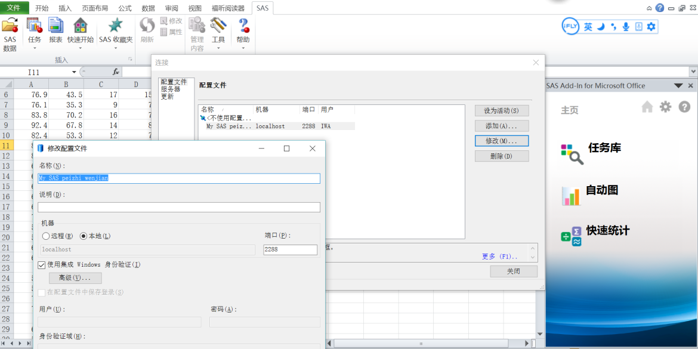

对于远程连接SAS模式，Excel直接读取并数据透视之，甚至自动图或快速统计，也都非常方便愉快。

