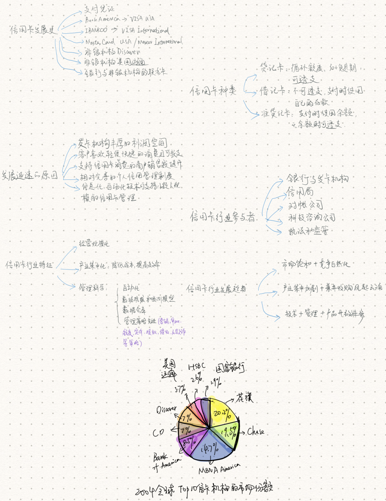
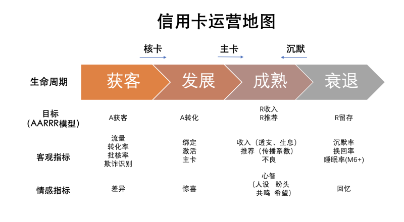

- [2.3.1 现代信用卡管理](#231-现代信用卡管理)
- [2.3.2 信用卡运营](#232-信用卡运营)
  - [2.3.2.1 客户信用卡生命周期](#2321-客户信用卡生命周期)
  - [2.3.2.2 信用卡运营地图](#2322-信用卡运营地图)

### 2.3.1 现代信用卡管理
划重点！！本文较多思想仍出于此书，只是我们在编写上把侧重点放到决策科学上而已。

- 目录摘要：
> 第一章 欧美信用卡行业介绍
> 
> 第一节 信用卡的发展历史
> 
> 第二节 信用卡的行业迅速发展的原因
> 
> 第三节 信用卡的种类
> 
> 第四节 信用卡行业的参与者
> 
> 第五节 信用卡行业的特征
> 
> 第六节 信用卡行业的发展趋势
>  
> 第二章 欧美社会征信体系介绍
> 
> 第一节 欧美社会征信体系的动作模式
> 
> 第二节 社会征信体系的法律基础
> 
> 第三节 社会征信体系与巴赛尔协议
>  
> 第三章 信用卡管理综述
> 
> 第一节 信用卡的盈利模式分析
> 
> 第二节 信用卡的生命周期管理
> 
> 第三节 信用卡的风险管理
> 
> 第四节 信用卡业务的组织形式
>  
> 第四章 信用卡管理的信用基础
> 
> 第一节 信用卡的数据仓库系统
> 
> 第二节 信用卡的管理信息系统
>  
> 第五章 信用评分模型的发展与应用
> 
> 第一节 模型开发的选择
> 
> 第二节 模型的样本
> 
> 第三节 模型的变量
> 
> 第四节 模型的分组
> 
> 第五节 模型的规定
> 
> 第六节 模型的检验
> 
> 第七节 模型的实施与跟踪
>  
> 第六章 信用卡的市场营销策划 
> 
> 第一节 信用卡的市场竞争策略
> 
> 第二节 信用卡的市场调查
> 
> 第三节 信用卡的产品设计
> 
> 第四节 信用卡的营销渠道
>  
> 第七章 信用卡的数据库营销
> 
> 第一节 信用卡数据库营销的历史演进
> 
> 第二节 信用卡数据库营销的理念和优势
> 
> 第三节 信用卡数据库营销的流程
>  
> ...
>  
> 第八章 信用卡申请的审批管理
> 
> 第九章 信用卡的账户管理
>  
> 第十章 信用卡的坏账管理
>  
> 第十一章 信用卡的催收管理
>  
> 第十二章 信用卡的反欺诈管理
>  
> 第十三章 信用卡的决策最优化技术

- 内容摘要：

> 摘录简书-百分号

  
  
  
  
  
  

- 期待原作者能继续更新，或者更多人奉献到《现代信用卡管理》的解读中来。

### 2.3.2 信用卡运营
#### 2.3.2.1 客户信用卡生命周期

#### 2.3.2.2 信用卡运营地图

