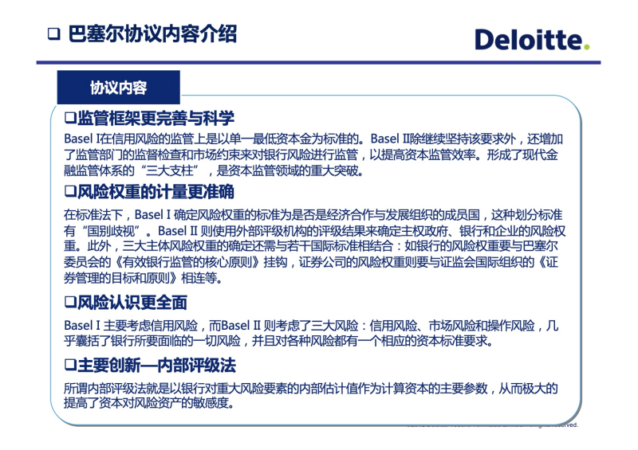
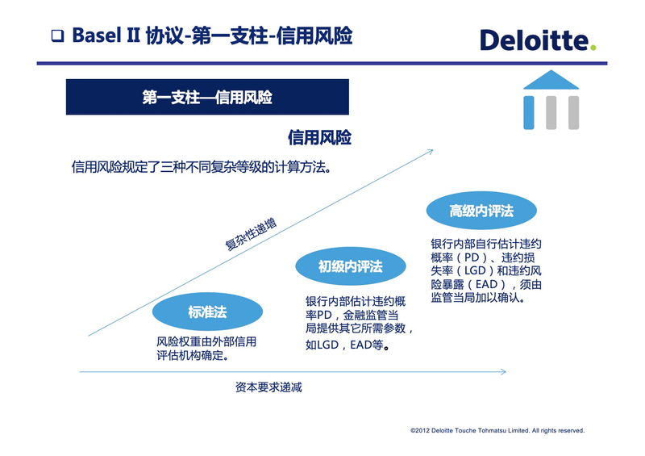

- [2.5.1 巴塞尔协议](#251-巴塞尔协议)
- [2.5.2 风险管理概论](#252-风险管理概论)

这里不对风险部分展开细节讨论，但宏观地点出巴塞尔协议、风险管理概论等。
### 2.5.1 巴塞尔协议

  
  
  
  
  
  
  
  
  
  
  
  
  
  
  
  
  
  
  
  
  
  
  

> 选自《巴塞尔新资本协议达标核心要素-Deloitte/德勤》

### 2.5.2 风险管理概论

> 林亚臣《零售金融风险管理概论》
> 作者曾任美国Fidelity National 副总裁、美国大通银行资深副总裁、广发银行首席信贷官兼零售银行副总裁。
> 现任马上金融副总经理。

以下简介之：
自1978年改革开放以来，中国才有了真正意义上的商业银行，但直到20世纪90年代才有了所谓零售金融，而且以负债业务（储蓄）为主。例如，中国的房屋按揭从20世纪90年代初开始，直到2000年以后才慢慢普及。另外，尽管在1985年中国银行尝试发行了长城卡，但真正意义上的信用卡业务则是从2002年有了中国银联以后的事，这就是为什么2003年被行业称为信用卡元年的原因。在同一时间里，美国的零售金融进入了新的阶段——量化分析工具在零售金融领域全面应用。一个最为有代表性的事件就是信用评分技术在美国90年代被广泛应用，以及以后的2000年至2010年的策略优化技术的推广使用。笔者将这两种技术结合，统称为决策分析技术。之后，笔者将这个技术的数学基础和常见的评分技术算法如Logistic Regression、SVM、GBDT、FNN，以及常见的策略优化技术算法如RSM、CART、CHIAD、IP、CN整合，在《零售金融风险管理概论》的附录中给予简短集中的介绍。书中其他各章所讨论涉及的决策分析技术，也都在逻辑推理层面进行详细介绍，读者完全可以按照书中逻辑步骤选择一两个方法进行尝试。

零售金融领域是一个只有在科学量化管理下才能做大做强的行业，而决策分析技术就是应用于零售金融行业的主要量化工具。在不到20年的时间里，决策分析技术在中国的零售金融行业的应用已有了质的飞跃。从当年几乎无人知晓何为“信用评分技术”到今天绝大多数金融机构分布式大数据计算、机器学习、人工智能等的广泛应用，中国零售金融行业经历了翻天覆地的变化。 但，是否仅仅应用了前沿量化管理方法就可以做大做强零售金融了呢？答案是，这还远远不够。从国际国内零售金融行业历史上来看，成功者和失败者最大的区别在于是否全面完整地掌握了零售金融的核心逻辑。

零售金融的核心逻辑到底是什么？它实质上蕴含在各个具体的业务中。例如，人们常说风险管理是踩刹车，为什么说这句话蕴含着对风险管理的误解？信贷风险管理到底该如何管理？讨论风险管理，首先要准确理解什么是风险。人们常说风险是不确定性，尽管不能说这个定义有错，但实质上它并未揭示风险最根本的特征。风险最根本的特征是发生不利结果的可能性。 由这个定义，可以进一步揭示风险具有三大特性：一是普遍存在性；二是相关可预测性；三是普遍关联性。这三大特性决定了风险管理必须进行体系化管理，而体系化管理就决定了风险管理是个全流程管理，绝对不是踩刹车，而是做最优化。因此，最简短叙述何为风险管理应该如下：寻求有条件的最优解，即在风险可控的条件下，极大化资本投资回报。认为风险管理就是踩刹车极为普遍，可想而知，有太多的金融从业人员至今仍误解风险管理，没有准确理解零售金融的核心逻辑。

如果把上面这些结论应用到零售金融的信贷业务，人们要问信贷风险管理该如何管？先明确什么是信贷：信贷是出资方（债权人）按约定条件转让资金使用权给用资方（债务人）的且具有法律约束的经济关系。在这个经济关系中，永远存在这样的可能性，即债务人未按约定履行经济关系中的责任。因此，对债权人来说，发生不利结果的可能性永远存在，即风险永远存在。根据风险的三大特性，必须对信贷业务进行体系化的全流程风险管理。懂得这个道理就不会出现过去经常发生在金融机构的事 —— 发生了不良贷款，领导就质问信审部：你们怎么审的贷款？作为实例，书中给出了做好小微信贷业务风险管理的例子，并讨论分析了必须在其各个环节都实施有效的风险管理。这些环节可分为：如何定位产品和设计产品；如何实施渠道管理；如何销售；如何信审；如何做贷后管理；如何催收和不良资产处置；如何矫正和进一步优化。

尽管各个具体业务线都有不同侧重，但都反映了共同的金融本质，这就是风险。将这个共同的本质提炼升华，借助前沿的科学量化管理方法和凝聚几千年文明发展的中华智慧，笔者提出了“道、天、地、将、法”五位一体的风险管理体系；而这个风险管理体系通过落实“法”的五个子体系（政策体系、流程体系、制度体系、系统体系、监控体系）和它们之间的相互作用将每日的风险管理工作进行有序实施。

中国金融出版社出版的新书从多个角度揭示了零售金融的核心逻辑，准确、翔实地回答了前面诸多问题。同时，本书开创了行业之先河，创造了多项行业第一：首先，本书是中国零售金融业的第一本基于实战且全面阐述零售风险管理的力作，是凝聚了笔者国际国内多年从业实践、创新和理论贡献之作，也是依据现代科技发展方向，对未来零售金融发展及演化理性展望之作。其次，本书是中国零售金融行业自改革开放以来，基于中国商业金融市场化发展，指导如何在中国的金融实践中，做好零售金融风险管理工作的奠基性著作。最后，本书是立足于中华传统智慧，结合最前沿的科学技术，将“道”和“术”两方面完美结合之作。

> 笔者认为，是一本所有从事金融或零售金融行业人员的必备之书，无论您在金融或零售金融行业做什么工作，都应该对零售金融的核心逻辑有一定了解。而对从事科技研发、业务拓展、市场营销、数据分析、模型构造、风险管理等人员来说，全面完整地理解零售金融的核心逻辑是您交付高质量工作的基础。

