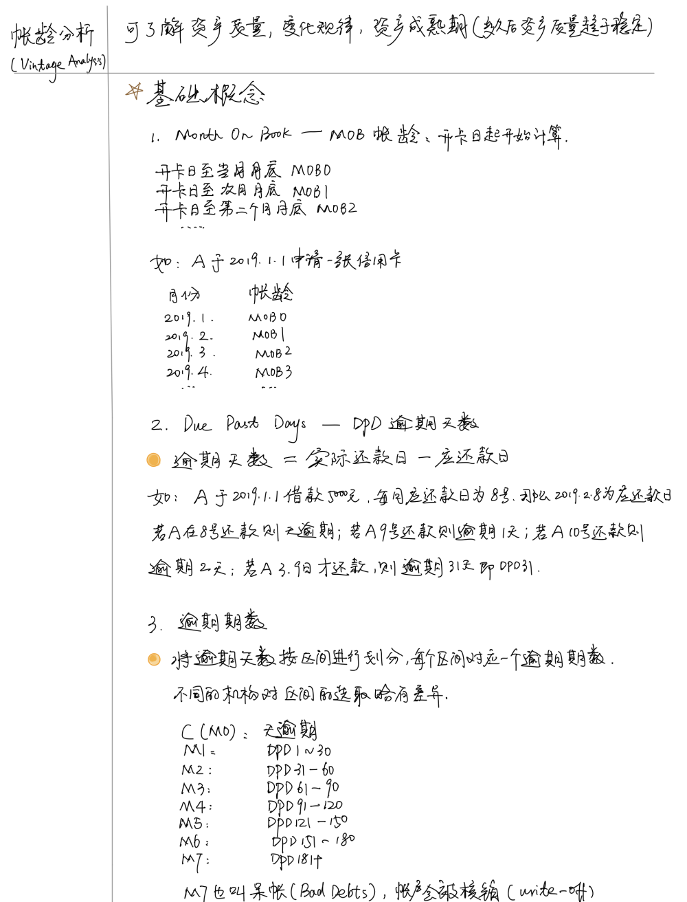
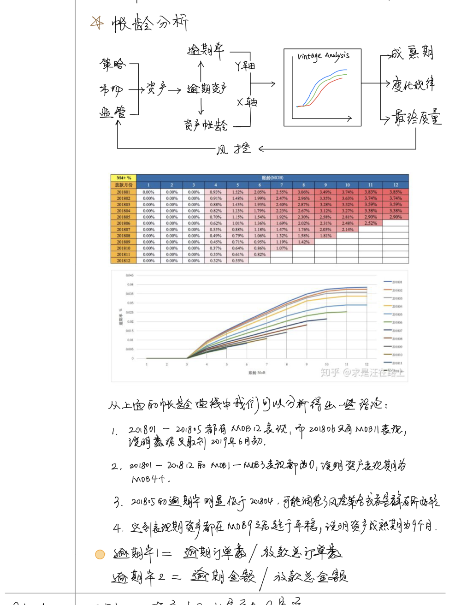
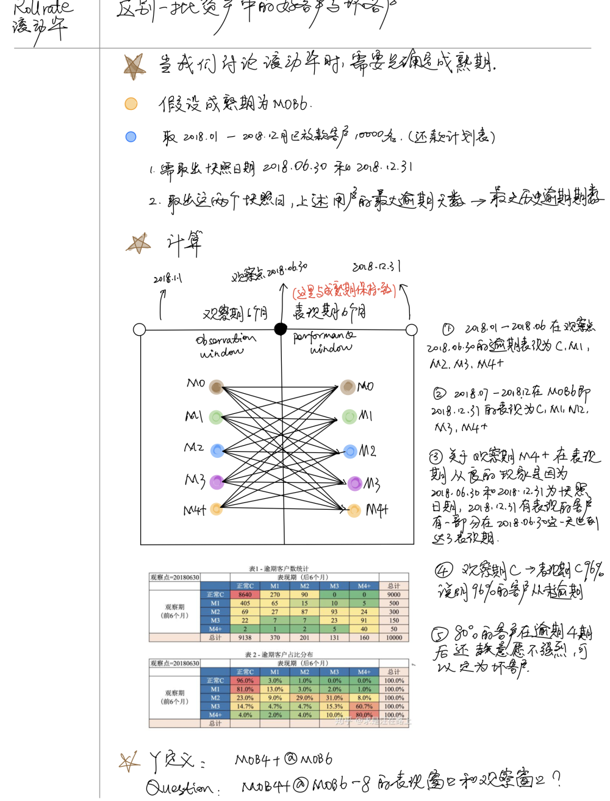

- [4.1.1 统计维度](#411-统计维度)
  - [4.1.1.1 描述统计](#4111-描述统计)
  - [4.1.1.2 假设检验](#4112-假设检验)
  - [4.1.1.3 信度分析](#4113-信度分析)
  - [4.1.1.4 列联表分析](#4114-列联表分析)
  - [4.1.1.5 相关分析](#4115-相关分析)
  - [4.1.1.6 方差分析](#4116-方差分析)
  - [4.1.1.7 回归分析](#4117-回归分析)
  - [4.1.1.8 聚类分析](#4118-聚类分析)
  - [4.1.1.9 判别分析](#4119-判别分析)
  - [4.1.1.A 主成分分析](#411a-主成分分析)
  - [4.1.1.B 因子分析](#411b-因子分析)
  - [4.1.1.C 时间序列分析](#411c-时间序列分析)
  - [4.1.1.D 生存分析](#411d-生存分析)
  - [4.1.1.E 典型相关分析](#411e-典型相关分析)
  - [4.1.1.F ROC分析](#411f-roc分析)
  - [4.1.1.G 其他分析方法](#411g-其他分析方法)
- [4.1.2 风险维度](#412-风险维度)
  - [4.1.2.1 Vintage Analysis](#4121-vintage-analysis)
  - [4.1.2.2 Roll Rate Analysis](#4122-roll-rate-analysis)
- [4.1.3 运营维度](#413-运营维度)
  - [4.1.3.1 SWOT](#4131-swot)
  - [4.1.3.2 4P](#4132-4p)
  - [4.1.3.3 PEST](#4133-pest)
  - [4.1.3.4 SMART](#4134-smart)
  - [4.1.3.5 5W2H](#4135-5w2h)
- [4.1.4 方法维度](#414-方法维度)
  - [4.1.4.1 公式法](#4141-公式法)
  - [4.1.4.2 象限法](#4142-象限法)
  - [4.1.4.3 二八法/帕累托分析](#4143-二八法帕累托分析)
  - [4.1.4.4 漏斗法](#4144-漏斗法)
  - [4.1.4.5 逻辑树分析方法](#4145-逻辑树分析方法)
  - [4.1.4.6 多维度拆解分析方法](#4146-多维度拆解分析方法)
  - [4.1.4.7 假设检验分析方法](#4147-假设检验分析方法)
  - [4.1.4.8 PEST分析法](#4148-pest分析法)
  - [4.1.4.9 AARRR漏斗模型](#4149-aarrr漏斗模型)
  - [4.1.4.A 杜邦分析法](#414a-杜邦分析法)
  - [4.1.4.B 用户生命周期](#414b-用户生命周期)
- [4.1.5 其他分析](#415-其他分析)

> 分析方法需要实际践行，不然就是纸上谈兵，所谓知行合一。

以下按照不同维度划分，可能存在部分维度分析方法一致。
部分概念介绍取自百度百科，有兴趣的同学可自行补充实际案例。

### 4.1.1 统计维度
#### 4.1.1.1 描述统计
描述性统计是指运用制表和分类，图形以及计算概括性数据来描述数据的集中趋势、离散趋势、偏度、峰度。

（1）缺失值填充：常用方法：剔除法、均值法、最小邻居法、比率回归法、决策树法。

（2）正态性检验：很多统计方法都要求数值服从或近似服从正态分布，所以之前需要进行正态性检验。
常用方法：非参数检验的K-量检验、P-P图、Q-Q图、W检验、动差法。

#### 4.1.1.2 假设检验

（1）参数检验

参数检验是在已知总体分布的条件下（一股要求总体服从正态分布）对一些主要的参数(如均值、百分数、方差、相关系数等）进行的检验 。

1）U检验 使用条件：当样本含量n较大时，样本值符合正态分布；

2）T检验 使用条件：当样本含量n较小时，样本值符合正态分布；

A 单样本T检验：推断该样本来自的总体均数μ与已知的某一总体均数μ0 (常为理论值或标准值)有无差别；

B 配对样本T检验：当总体均数未知时，且两个样本可以配对，同对中的两者在可能会影响处理效果的各种条件方面扱为相似；

C 两独立样本T检验：无法找到在各方面极为相似的两样本作配对比较时使用。

（2）非参数检验

非参数检验则不考虑总体分布是否已知，常常也不是针对总体参数，而是针对总体的某些一股性假设（如总体分布的位罝是否相同，总体分布是否正态）进行检验。

适用情况：顺序类型的数据资料，这类数据的分布形态一般是未知的。

A 虽然是连续数据，但总体分布形态未知或者非正态；

B 体分布虽然正态，数据也是连续类型，但样本容量极小，如10以下；

主要方法包括：卡方检验、秩和检验、二项检验、游程检验、K-量检验等。

#### 4.1.1.3 信度分析

检査测量的可信度，例如调查问卷的真实性。

（1）外在信度：不同时间测量时量表的一致性程度，常用方法重测信度；

（2）内在信度；每个量表是否测量到单一的概念，同时组成两表的内在体项一致性如何，常用方法分半信度。

#### 4.1.1.4 列联表分析

用于分析离散变量或定型变量之间是否存在相关。对于二维表，可进行卡方检验，对于三维表，可作Mentel-Hanszel分层分析，列联表分析还包括配对计数资料的卡方检验、行列均为顺序变量的相关检验。

#### 4.1.1.5 相关分析

研究现象之间是否存在某种依存关系，对具体有依存关系的现象探讨相关方向及相关程度。

（1）单相关： 两个因素之间的相关关系叫单相关，即研究时只涉及一个自变量和一个因变量；

（2）复相关 ：三个或三个以上因素的相关关系叫复相关，即研究时涉及两个或两个以上的自变量和因变量相关；

（3）偏相关：在某一现象与多种现象相关的场合，当假定其他变量不变时，其中两个变量之间的相关关系称为偏相关。

#### 4.1.1.6 方差分析

使用条件：各样本须是相互独立的随机样本；各样本来自正态分布总体；各总体方差相等

（1）单因素方差分析：一项试验只有一个影响因素，或者存在多个影响因素时，只分析一个因素与响应变量的关系；

（2）多因素有交互方差分析：一顼实验有多个影响因素，分析多个影响因素与响应变量的关系，同时考虑多个影响因素之间的关系；

（3）多因素无交互方差分析：分析多个影响因素与响应变量的关系，但是影响因素之间没有影响关系或忽略影响关系；

（4）协方差分祈：传统的方差分析存在明显的弊端，无法控制分析中存在的某些随机因素，使之影响了分祈结果的准确度。协方差分析主要是在排除了协变量的影响后再对修正后的主效应进行方差分析，是将线性回归与方差分析结合起来的一种分析方法，

#### 4.1.1.7 回归分析

（1）一元线性回归分析：只有一个自变量X与因变量Y有关，X与Y都必须是连续型变量，因变量y或其残差必须服从正态分布。

（2）多元线性回归分析
使用条件：分析多个自变量与因变量Y的关系，X与Y都必须是连续型变量，因变量y或其残差必须服从正态分布 。

1）变呈筛选方式：选择最优回归方程的变里筛选法包括全横型法（CP法）、逐步回归法，向前引入法和向后剔除法；

2）横型诊断方法：

A 残差检验： 观测值与估计值的差值要艰从正态分布；

B 强影响点判断：寻找方式一般分为标准误差法、Mahalanobis距离；

C 共线性诊断诊断方式：容忍度、方差扩大因子法(又称膨胀系数VIF)、特征根判定法、条件指针CI、方差比例

处理方法：增加样本容量或选取另外的回归如主成分回归、岭回归等；

（3）Logistic回归分析

线性回归模型要求因变量是连续的正态分布变里，且自变量和因变量呈线性关系，而Logistic回归模型对因变量的分布没有要求，一般用于因变量是离散时的情况。

Logistic回归模型有条件与非条件之分，条件Logistic回归模型和非条件Logistic回归模型的区别在于参数的估计是否用到了条件概率。

（4）其他回归方法 非线性回归、有序回归、Probit回归、加权回归等

#### 4.1.1.8 聚类分析

样本个体或指标变量按其具有的特性进行分类，寻找合理的度量事物相似性的统计量。

（1）性质分类：

Q型聚类分析：对样本进行分类处理，又称样本聚类分祈 使用距离系数作为统计量衡量相似度，如欧式距离、极端距离、绝对距离等；

R型聚类分析：对指标进行分类处理，又称指标聚类分析 使用相似系数作为统计量衡量相似度，相关系数、列联系数等；

（2）方法分类：

1）系统聚类法： 适用于小样本的样本聚类或指标聚类，一般用系统聚类法来聚类指标，又称分层聚类；

2）逐步聚类法 ：适用于大样本的样本聚类；

3）其他聚类法 ：两步聚类、K均值聚类等；

#### 4.1.1.9 判别分析

（1）判别分析：根据已掌握的一批分类明确的样品建立判别函数，使产生错判的事例最少，进而对给定的一个新样品，判断它来自哪个总体

（2）与聚类分析区别：

1）聚类分析可以对样本逬行分类，也可以对指标进行分类；而判别分析只能对样本

2）聚类分析事先不知道事物的类别，也不知道分几类；而判别分析必须事先知道事物的类别，也知道分几类

3）聚类分析不需要分类的历史资料，而直接对样本进行分类；而判别分析需要分类历史资料去建立判别函数，然后才能对样本进行分类

（3）主要方法

1）Fisher判别分析法 ：

以距离为判别准则来分类，即样本与哪个类的距离最短就分到哪一类， 适用于两类判别；

以概率为判别准则来分类，即样本属于哪一类的概率最大就分到哪一类，适用于适用于多类判别。

2）BAYES判别分析法 ：

BAYES判别分析法比FISHER判别分析法更加完善和先进，它不仅能解决多类判别分析，而且分析时考虑了数据的分布状态，所以一般较多使用；

#### 4.1.1.A 主成分分析

将彼此梠关的一组指标变适转化为彼此独立的一组新的指标变量，并用其中较少的几个新指标变量就能综合反应原多个指标变量中所包含的主要信息 。

#### 4.1.1.B 因子分析

一种旨在寻找隐藏在多变量数据中、无法直接观察到却影响或支配可测变量的潜在因子、并估计潜在因子对可测变量的影响程度以及潜在因子之间的相关性的一种多元统计分析方法

与主成分分析比较：

相同：都能够起到梳理多个原始变量内在结构关系的作用；

不同：主成分分析重在综合原始变适的信息，而因子分析重在解释原始变量间的关系，是比主成分分析更深入的一种多元统计方法；

用途：

1）减少分析变量个数；

2）通过对变量间相关关系探测，将原始变量进行分类；

#### 4.1.1.C 时间序列分析
动态数据处理的统计方法，研究随机数据序列所遵从的统计规律，以用于解决实际问题；时间序列通常由4种要素组成：趋势、季节变动、循环波动和不规则波动。主要方法：移动平均滤波与指数平滑法、ARIMA横型、量ARIMA横型、ARIMAX模型、自回归横型、ARCH族模型。

#### 4.1.1.D 生存分析
用来研究生存时间的分布规律以及生存时间和相关因索之间关系的一种统计分析方法

（1）包含内容：

1）描述生存过程，即研究生存时间的分布规律；

2）比较生存过程，即研究两组或多组生存时间的分布规律，并进行比较；

3）分析危险因素，即研究危险因素对生存过程的影响；

4）建立数学模型，即将生存时间与相关危险因素的依存关系用一个数学式子表示出来。

（2）方法：

1）统计描述：包括求生存时间的分位数、中数生存期、平均数、生存函数的估计、判断生存时间的图示法，不对所分析的数据作出任何统计推断结论；

2）非参数检验：检验分组变量各水平所对应的生存曲线是否一致，对生存时间的分布没有要求，并且检验危险因素对生存时间的影响。

A 乘积极限法

B 寿命表法

3）半参数横型回归分析：在特定的假设之下，建立生存时间随多个危险因素变化的回归方程，这种方法的代表是Cox比例风险回归分析法；

4）参数模型回归分析：已知生存时间服从特定的参数横型时，拟合相应的参数模型，更准确地分析确定变量之间的变化规律。

#### 4.1.1.E 典型相关分析

相关分析一般分析两个变量之间的关系，而典型相关分析是分析两组变里（如3个学术能力指标与5个在校成绩表现指标）之间相关性的一种统计分析方法。
典型相关分析的基本思想和主成分分析的基本思想相似，它将一组变量与另一组变量之间单变量的多重线性相关性研究转化为对少数几对综合变量之间的简单线性相关性的研究，并且这少数几对变量所包含的线性相关性的信息几乎覆盖了原变量组所包含的全部相应信息。

#### 4.1.1.F ROC分析
ROC曲线是根据一系列不同的二分类方式(分界值或决定阈）以真阳性率（灵敏度)为纵坐标，假阳性率（1-特异度)为横坐标绘制的曲线。

用途：

1、ROC曲线能很容易地査出任意界限值时的对疾病的识别能力；

2、选择最佳的诊断界限值。ROC曲线越靠近左上角，试验的准确性就越高；

3、两种或两种以上不同诊断试验对疾病识别能力的比较，一股用R0C曲线下面积反映诊断系统的准确性。

#### 4.1.1.G 其他分析方法
多重响应分析、距离分析、项目分析、对应分析、决策树分析、神经网络、系统方程、蒙特卡洛模拟等。

### 4.1.2 风险维度
#### 4.1.2.1 Vintage Analysis
在葡萄酒行业，常常会使用Vintage Analysis来帮助判断不同产区、不同种类的葡萄酒在不同年份下所呈现的品质与口感。如下图所示，图中红圈中的“1975”即为葡萄酒中所称的“Vintage”，它表示制造该酒所使用的葡萄（大部分）生长和收获的年份。Vintage Analysis在当时用来分析葡萄酒的品质是否会因葡萄生长的年份、气候不同而有显著区别，并评估不同年份的葡萄酒的品质随着窖藏时间的推移而发生的变化。

<p align="center">

</p>

慢慢演变为一种分析方法，且这个概念很适合信用风险领域用它来评估客户好坏充分暴露所需的时间。

> 摘录简书-百分号

<p align="center">

</p>

<p align="center">

</p>

#### 4.1.2.2 Roll Rate Analysis
> 摘录简书-百分号

<p align="center">

</p>

### 4.1.3 运营维度
#### 4.1.3.1 SWOT
SWOT分析法常常被用于制定集团发展战略和分析竞争对手情况，在战略分析中，它是最常用的方法之一。
进行SWOT分析时，主要有以下几个方面的内容：

（1）分析环境因素
运用各种调查研究方法，分析出公司所处的各种环境因素，即外部环境因素和内部能力因素。外部环境因素包括机会因素和威胁因素，它们是外部环境对公司的发展直接有影响的有利和不利因素，属于客观因素，内部环境因素包括优势因素和弱点因素，它们是公司在其发展中自身存在的积极和消极因素，属主观因素，在调查分析这些因素时，不仅要考虑到历史与现状，而且更要考虑未来发展问题。

优势，是组织机构的内部因素，具体包括：有利的竞争态势；充足的财政来源；良好的企业形象；技术力量；规模经济；产品质量；市场份额；成本优势；广告攻势等；
劣势，也是组织机构的内部因素，具体包括：设备老化；管理混乱；缺少关键技术；研究开发落后；资金短缺；经营不善；产品积压；竞争力差等；
机会，是组织机构的外部因素，具体包括：新产品；新市场；新需求；外国市场壁垒解除；竞争对手失误等；
威胁，也是组织机构的外部因素，具体包括：新的竞争对手；替代产品增多；市场紧缩；行业政策变化；经济衰退；客户偏好改变；突发事件等；
SWOT方法的优点在于考虑问题全面，是一种系统思维，而且可以把对问题的“诊断”和“开处方”紧密结合在一起，条理清楚，便于检验。

（2）构造SWOT矩阵
将调查得出的各种因素根据轻重缓急或影响程度等排序方式，构造SWOT矩阵。在此过程中，将那些对公司发展有直接的、重要的、大量的、迫切的、久远的影响因素优先排列出来，而将那些间接的、次要的、少许的、不急的、短暂的影响因素排列在后面。

#### 4.1.3.2 4P

在市场营销组合观念中，4p是指：产品/product、价格/price、渠道/place、促销/promotion，4p理论是营销策略的基础。

（1）产品的组合
主要包括产品的实体、服务、品牌、包装。它是指企业提供给目标市场的货物、服务的集合, 包括产品的效用、质量、外观、式样、品牌、包装和规格, 还包括服务和保证等因素。

（2）价格的组合
主要包括基本价格、折扣价格、付款时间、借贷条件等。它是指企业出售产品所追求的经济回报。

（3）分销的组合
地点通常称为分销的组合, 它主要包括分销渠道、储存设施、运输设施、存货控制, 它代表企业为使其产品进入和达到目标市场所组织, 实施的各种活动, 包括途径、环节、场所、仓储和运输等。

（4）促销组合
促销组合是指企业利用各种信息载体与目标市场进行沟通的传播活动, 包括广告、人员推销、营业推广与公共关系等等。

#### 4.1.3.3 PEST

PEST 为一种企业所处宏观环境分析模型，所谓PEST，即P是政治/Politics、E是经济/Economy、S是社会/Society、T是技术Technology。

（1）政治会对企业监管、消费能力以及其他与企业有关的活动产生十分重大的影响力。一个国家或地区的政治制度、体制、方针政策、法律法规等方面。这些因素常常制约、影响着企业的经营行为，尤其影响企业较长期的投资行为。

（2）经济主要指国民经济发展的总概况，国际和国内经济形式及经济发展趋势，企业所面临的产业环境和竞争环境等.市场营销人员需要从短期与长期两个方面来看待一个国家的经济与贸易，特别是在进行国际营销的时候。

（3）社会主要指一定时期整个社会发展的一般状况。主要包括社会道德风尚，文化传统，人口变动趋势，文化教育，价值观念，社会结构等。各国的社会与文化对于企业的影响不尽相同。

（4）技术主要是指社会技术总水平及变化趋势，技术变迁，技术突破对企业影响，以及技术对政治、经济社会环境之间的相互作用的表现等（具有变化快，变化大，影响面大等特点）。

#### 4.1.3.4 SMART
SMART原则（S=Specific、M=Measurable、A=Attainable、R=Relevant、T=Time-bound）是为了利于员工更加明确高效地工作，更是为了管理者将来对员工实施绩效考核提供了考核目标和考核标准，使考核更加科学化、规范化，更能保证考核的公正、公开与公平。

（1）S代表具体(Specific)，指绩效考核要切中特定的工作指标，不能笼统；

（2）M代表可度量(Measurable)，指绩效指标是数量化或者行为化的，验证这些绩效指标的数据或者信息是可以获得的；

（3）A代表可实现(Attainable)，指绩效指标在付出努力的情况下可以实现，避免设立过高或过低的目标；

（4）R代表相关性(Relevant)，指绩效指标是与工作的其它目标是相关联的；绩效指标是与本职工作相关联的；

（5）T代表有时限(Time-bound)，注重完成绩效指标的特定期限。

#### 4.1.3.5 5W2H
5W2H分析法又叫七问分析法，是二战中美国陆军兵器修理部首创。简单、方便，易于理解、使用，富有启发意义，广泛用于企业管理和技术活动，对于决策和执行性的活动措施也非常有帮助，也有助于弥补考虑问题的疏漏。
发明者用五个以W开头的英语单词和两个以H开头的英语单词进行设问，发现解决问题的线索，寻找发明思路，进行设计构思，从而搞出新的发明项目，这就叫做5W2H法。

（1）WHAT——是什么？目的是什么？做什么工作？

（2）WHY——为什么要做？可不可以不做？有没有替代方案？

（3）WHO——谁？由谁来做？

（4）WHEN——何时？什么时间做？什么时机最适宜？

（5）WHERE——何处？在哪里做？

（6）HOW ——怎么做？如何提高效率？如何实施？方法是什么？

（7）HOW MUCH——多少？做到什么程度？数量如何？质量水平如何？费用产出如何？

### 4.1.4 方法维度
#### 4.1.4.1 公式法
所谓公式法就是针对某个指标，用公式层层分解该指标的影响因素。

如分析某产品的销售额较低的原因，用公式法分解：渠道销售量 = 点击用户数 X 下单率。

#### 4.1.4.2 象限法
通过对两种及以上维度的划分，运用坐标的方式表达出想要的价值。由价值直接转变为策略， 从而进行一些落地的推动。象限法是一种策略驱动的思维，常于产品分析、市场分析、客户管理、商品管理等。

比如一个广告点击率X广告转化率的四象限分布：

（1）高点击率高转化的广告，说明人群相对精准，是一个高效率的广告；

（2）高点击率低转化的广告，说明点击进来的人大多被广告吸引了，转化低说明广告内容针对的人 群和产品实际受众有些不符；

（3）高转化低点击的广告，说明广告内容针对的人群和产品实际受众符合程度较高，但需要优化广 告内容，吸引更多人点击；

（4）低点击率低转化的广告，可以放弃；

象限法的优势:

（1）找到问题的共性原因；

（2）建立分组优化策略；

#### 4.1.4.3 二八法/帕累托分析
二八法也可以叫帕累托法则，源于经典的二八法则。比如在个人财富上可以说世界上 20%的 人掌握着 80%的财富。而在数据分析中，则可以理解为 20%的数据产生了 80%的效果需要围 绕这 20%的数据进行挖掘。往往在使用二八法则的时候和排名有关系，排在前 20%的才算是 有效数据。二八法是抓重点分析，适用于任何行业。找到重点，发现其特征，然后可以思考如 何让其余的 80%向这 20%转化，提高效果。

#### 4.1.4.4 漏斗法
漏斗法即是漏斗图，有点像倒金字塔，是一个流程化的思考方式，常用于像新用户的开发、购 物转化率这些有变化和一定流程的分析中。

整体漏斗模型的核心思想其实可以归为分解和量化。一个营销漏斗能形象展示了从获取用户到最终转化成购买这整个流程中的一个个子环 节。相邻环节的转化率则就是指用数据指标来量化每一个步骤的表现。所以整个漏斗模型就是先将整个购买流程拆分成一个个步骤，然后用转化率来衡量每一个步骤的表现，最后通过异常的数据指标找出有问题的环节，从而解决问题，优化该步骤，最终达到提升整体购买转化率的目的。

#### 4.1.4.5 逻辑树分析方法
将复杂问题拆解成多子个问题进行分析不断地分解问题。逻辑树又称问题树、分解树等。逻辑树是将问题的所有子问题分层罗列，从最高层开始并逐步向下扩展。将复杂问题经过合理的假设拆解成一个一个子问题。

#### 4.1.4.6 多维度拆解分析方法

（1）分析维度

顾名思义从多个维度拆解分析数据(维度、拆解)。在数据分析中，通过不同的维度去观察同一组数据，从而观察数据变化后的原因。大部分数据变化可以从"数据指标"和"业务流程"两个方向进行拆解分析。

"数据指标"维度：指的是数据指标构成因素的分析，比如用户指标（包含新增用户，留存用户等）；

"业务流程"维度：指的是在实际业务流程中的因素分析，比如渠道分析（不同渠道的推广效果，不同渠道的付费率）；

（2）辛普森悖论

在某些情况下对整体数据的分析和对部分数据的分析会得到完全相反的结论。（在分析数据时往往只看到整体数据的变化而忽略包含的各个部分数据构成产生的差异。导致数据不准确。）

#### 4.1.4.7 假设检验分析方法

指的是一种使用数据来做决策的逻辑推理过程，分为提出假设，收集证据，得出结论。

（1）提出假设；

（2）收集数据；

（3）得出结论

#### 4.1.4.8 PEST分析法

即Policy、Economy、Society、Technology。

#### 4.1.4.9 AARRR漏斗模型

AARRR模型对应产品运营的 5 个重要环节，分别是：

第一环节是获取用户（Acquisition ）：用户如何找到我们？

第二环节是激活用户（Activation）：用户的首次体验如何？

第三个环节是提高留存（Retention）：用户会回来吗？

第四个环节是增加收入（Revenue ）：如何赚到更多钱？

第五个环节推荐（Refer病毒式营销）： 用户会告诉其他人吗？

#### 4.1.4.A 杜邦分析法

将各种财务指标综合在一起来评价公司财务管理效果。即计算“用公司自己的钱赚取的利润率”/净资产收益率，拆解成三个指标相乘：
净资产收益率=销售净利率 X 总资产周转率 X 权益乘数

1）公司业务是否赚钱？

销售净利润=净利润/销售额，衡量公司业务是否赚钱。

2）公司资产运营效率如何？

总资产周转率=销售额/总资产，衡量公司资产运营效率如何。

3）公司债务负担有没有风险？

权益乘数=总资产/净资产，也叫做杠杆率，衡量公司负债经营的情况。

#### 4.1.4.B 用户生命周期

用户生命周期衍生于“客户生命周期”的概念，用户从不同角度有不同的分类法：

比如从用户活跃度来看，可以分为僵尸用户、低频用户、活跃用户和深度用户
从用户对平台的价值来看，可能分法就变成了种子用户、普通用户、核心用户。
从用户价值来看，分为无效用户、潜在用户、跟进用户、成单用户。

不同的行业有不同的分类，不同的分类也有不同的运营策略。而从用户生命周期的角度来解析和管理用户，是常见的数据分析方式之一。举例从用户活跃度来看，可能就要构建一个用户活跃度模型：

（1）流失用户：有一段时间没有再打开产品(曾经打开过产品），那么我们就视为流失用户，根据产品的属性，可以按30天，60天，90天等划分；

（2）不活跃用户：有一段时间没有打开产品，为了和流失区分开来，需要选择无交集的时间范围。比如流失用户是60天以上没打开产品，那么不活跃则是0～60天没打开；

（3）回流用户：有一段时间没用产品，之后突然回来再次使用，则称为回流用户。回流用户是活跃用户，且是由流失用户或不活跃用户唤回而来；

（4）活跃用户：一段时间内打开过产品；

（5）忠诚用户：也可以叫超级活跃用户，长期持续使用产品，比如连续四周，或者一个月内15天等

用户活跃可以简化为一个最简单的公式：新增用户的数量要大于流失用户的增加量。不同业务情况需要各自衡量，怎么去构建这个模型。

### 4.1.5 其他分析

```
细分分析
对比分析
漏斗分析
同期群分析
聚类分析
A/B测试
埋点分析
来源分析
用户分析
表单分析
```
