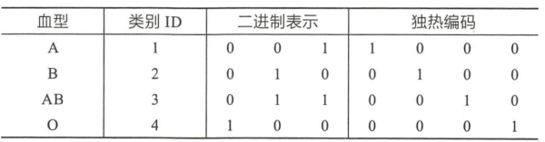
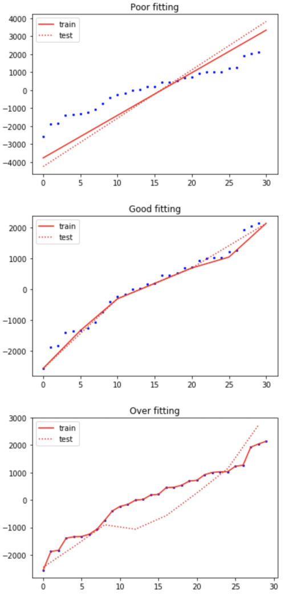

- [5.2.1 特征工程](#521-特征工程)
  - [5.2.1.1 数据清洗](#5211-数据清洗)
  - [5.2.1.2 类别平衡](#5212-类别平衡)
  - [5.2.1.3 数值缩放](#5213-数值缩放)
  - [5.2.1.4 类别编码](#5214-类别编码)
  - [5.2.1.5 分箱处理](#5215-分箱处理)
  - [5.2.1.6 特征选择](#5216-特征选择)
- [5.2.2 模型算法](#522-模型算法)
  - [5.2.2.1 逻辑回归](#5221-逻辑回归)
  - [5.2.2.2 决策树](#5222-决策树)
- [5.2.3 拟合问题](#523-拟合问题)
  - [5.2.3.1 欠拟合](#5231-欠拟合)
  - [5.2.3.2 过拟合](#5232-过拟合)

### 5.2.1 特征工程
特征工程即对原始数据进行一系列工程处理，将其提炼为特征，并去除原始数据中的杂质和冗余，更好地刻画求解的问题与预测模型之间的关系。特征越好，模型越灵活、简单、突出，是建模过程的关键步骤。
以下摘要之：

#### 5.2.1.1 数据清洗
引SAS课程中SAS数据清洗部分。
由于数据收集、数据加载、数据处理等引发的数据质量问题，易形成脏数据。 经过数据探索分析，并结合数据场景，发现数据可能存在:

- 重复值；
- 缺失值；
- 异常值(离群点)；
- 噪音数据；

如账户信息表，XACCOUNT账户号、CRED_LIMIT授信额度：
**(假设有业务设定：账户信息表的CRED_LIMIT授信额度范围[0, 5,000,000])**

（1）重复值

| XACCOUNT | CRED_LIMIT |
| --- | --- |
| 0001487730 | 10,000 |
| 0001487731 | 50,000 |
| 0001487731 | 50,000 |
| 0001487732 | 30,000 |

-  问题解析：账户号`0001487731`存在重复值； 
-  解决方法：根据某一业务条件（如数据时间取最新），予以去重处理； 

（2）缺失值

| XACCOUNT | CRED_LIMIT |
| --- | --- |
| 0001487730 | 10,000 |
| 0001487731 | . |
| 0001487732 | 50,000 |
| 0001487733 | 30,000 |

-  问题解析：账户号`0001487731`存在缺失值（SAS中用_._表示数值型缺失）； 
-  解决方法：不予处理（慎选）、删除含有缺失值的特征、插值补全缺失值； 

> 插值补全：
> 
> 1.均值/中位数/众数补全；
> 
> 2.同类别均值/中位数/众数补全；
> 
> 3.固定值补全；
> 
> 4.建模预测；
> 
> 5.手动补全；
> 
> 6.最近邻补全； 
> 
> ...


（3）异常值(离群点)
异常值指特殊的离群点，不一定错误。

| XACCOUNT | CRED_LIMIT |
| --- | --- |
| 0001487730 | 10,000 |
| 0001487731 | 1,000,000 |
| 0001487732 | 50,000 |
| 0001487733 | 30,000 |

-  问题解析：账户号`0001487731`存在异常值，额度达100W，但仍符合业务设定的； 
-  检测方法：统计描述、3$\sigma$原则、箱型图IQR、模型预测、最近邻检测、密度检测、聚类检测； 
-  解决方法：不予处理（慎选）、删除含有异常值的记录、视为缺失值处理； 

（4）噪音数据
噪音包括错误值或偏离期望的孤立点值。

| XACCOUNT | CRED_LIMIT |
| --- | --- |
| 0001487730 | 10,000 |
| 0001487731 | 10,000,000 |
| 0001487732 | 50,000 |
| 0001487733 | 30,000 |

- 问题解析：账户号`0001487731`存在噪音数据，额度达1000W，很明显的错误值；
- 解决方法：删除含有噪音数据的记录、根据错误原因修正（如重新加载）；

#### 5.2.1.2 类别平衡
简单来说，不同类别比例差异悬殊，如贷前反欺诈模型，欺诈坏样本较少，好坏比低至1000：1.
至少有以下解决方法：

（1）数据集扩充；

（2）更换评价指标；

（3）数据集重采样；

> 对小类的数据样本进行采样来增加小类的数据样本个数，即**过采样**（over-sampling ，采样的个数大于该类样本的个数）
> 对大类的数据样本进行采样来减少该类数据样本的个数，即**欠采样**（under-sampling，采样的次数少于该类样本的个数）


（4）人工生成数据；
> 1.基于经验对特征值进行随机采样；
> 
> 2.对特征值取值空间进行随机采样；
>  
> 3.基于最近邻的样本模拟，即**SMOTE**；
>  
> 其中，方法3与罗晟老师推荐方法基本思想一致。


（5）模型错误惩罚；

#### 5.2.1.3 数值缩放
专指数值型特征，用以消除特征之间的**量纲影响**。

（1）归一化

定义有数值型特征 $X$，最小值 $X_{min}$、最大值 $X_{max}$、均值 $X_{mean}$、标准差 $X_{std}$.

- 最小-最大值

$X_{norm} = \frac{X - X_{min}}{X_{max} - X_{min}}$

即将原特征缩放至 $[\frac{X_{min} - X_{min}}{X_{max} - X_{min}},\frac{X_{max} - X_{min}}{X_{max} - X_{min}}]$，即 $[0, 1]$区间范围。

- 标准差

$X_{norm} = \frac{X - X_{mean}}{X_{std}}$

即将原特征缩放至均值为 0，标准差为 1范围。

值得注意的是：

1、如果数据集分为训练集、验证集、测试集，那么**三个数据集都采用相同的归一化参数，数值都是通过训练集计算得到**，即上述两种方法中分别需要的数据最大值、最小值，方差和均值都是通过训练集计算得到。

2、归一化不是万能的。实际应用中，**通过梯度下降法求解的模型如逻辑回归，归一化能加快收敛速度**。但**决策树模型不需要**，归一化不会改变样本在特征 $X$上的信息增益。

#### 5.2.1.4 类别编码
专指类别型特征，用以转化类别型特征成数值型。

如下图，血型就是一个类别型特征，其具体值可以为A、B、AB、O，其编码方式有：

<p align="center">

</p>

（1）序号编码

序号编码一般用于处理类别间具有大小关系的数据。如血型A < 血型B关系不存在，编码后 $1 < 2$显然不合理。

但具体大小值设定仍需要恰当拿捏，如A、B、C表示不同风险等级，已知其对应坏账率0.03、0.30、1.50，编码后1、2、3虽然能体现大小关系，这样的信息是有损失的，不如直接使用0.03、0.30、1.50.

（2）二进制编码

二进制编码本质上是利用二进制对类别 ID 进行哈希映射，最终得到 0/1 特征向量，并且特征维度小于独热编码，更加节省存储空间。

（3）独热编码

即采用 $N$位状态位来对 _N_ 个可能的取值进行编码，用于处理类别间不具有大小关系的特征，便捷的是有时候可以把缺失值处理成单独的取值，并把特征进行稀疏处理。

在决策树模型上，不推荐对类别型特征进行独热编码。

（4）更多编码

- $WOE$ 编码
```python
# pip install category_encoders
import category_encoders as ce

encoder = ce.BackwardDifferenceEncoder(cols=[...])
encoder = ce.BaseNEncoder(cols=[...])
encoder = ce.BinaryEncoder(cols=[...])
encoder = ce.CatBoostEncoder(cols=[...])
encoder = ce.CountEncoder(cols=[...])
encoder = ce.GLMMEncoder(cols=[...])
encoder = ce.HashingEncoder(cols=[...])
encoder = ce.HelmertEncoder(cols=[...])
encoder = ce.JamesSteinEncoder(cols=[...])
encoder = ce.LeaveOneOutEncoder(cols=[...])
encoder = ce.MEstimateEncoder(cols=[...])
encoder = ce.OneHotEncoder(cols=[...])
encoder = ce.OrdinalEncoder(cols=[...])
encoder = ce.SumEncoder(cols=[...])
encoder = ce.PolynomialEncoder(cols=[...])
encoder = ce.TargetEncoder(cols=[...])
encoder = ce.WOEEncoder(cols=[...])

encoder.fit(X, y)
X_cleaned = encoder.transform(X_dirty)
```

#### 5.2.1.5 分箱处理
刘文穗老师的py_mob项目，[https://github.com/statcompute/py_mob](https://github.com/statcompute/py_mob)
> **py_mob**
> 
> |-- qtl_bin()  : An iterative discretization based on quantiles of X.
> 
> |-- bad_bin()  : A revised iterative discretization for records with Y = 1.
> 
> |-- iso_bin()  : A discretization algorthm driven by the isotonic regression between X and Y.
> 
> |-- rng_bin()  : A revised iterative discretization based on the equal-width range of X.
> 
> |-- kmn_bin()  : A discretization algorthm based on the kmean clustering of X.
> 
> |-- gbm_bin()  : A discretization algorthm based on the gradient boosting machine.
> 
> |-- summ_bin() : Generates the statistical summary for the binning outcome.
> 
> |-- view_bin() : Displays the binning outcome in a tabular form.
> 
> |-- cal_woe()  : Applies the WoE transformation to a numeric vector based on the binning outcome.
> 
> |-- pd_bin()   : Discretizes each vector in a pandas DataFrame.
> 
> |-- pd_woe()   : Applies WoE transformaton to each vector in the pandas DataFrame.
> 
> |-- get_data() : Loads the testing dataset.
> 


#### 5.2.1.6 特征选择
> Latin: lex parsimoniae.
> 
> Do not multiply entities beyond necessity.
> 
> 如无必要，勿增实体。
> 

如上，最简单的就是最好的，即特征选择基本哲学。
具体方法有很多，这里归纳为以下两大类：

（1）基于统计指标

- $IV$ 选择
- 方差选择
- 相关系数
- 卡方检验
- **RFE**特征权重
```python
from sklearn.feature_selection import RFE
```

- ...

（2）基于子集训练

给定特征集合为 $X: \{ X_1, X_2, ..., X_n\}$，拟选择出最优子集 $X^{\prime}: \{X_a, X_b, ...\}$，时间允许的情况下：

-  子集 $X^{\prime}$为空，从$X$选择一个特征 $X_m$加入 $X^{\prime}$，若最优则循环加入新特征，直至 $X^{\prime}$不如上一轮的 $X^{\prime}$； 
-  子集 $X^{\prime}$为 $X$，从 $X^{\prime}$选择一个特征 $X_m$将其移除，若最优则循环移除新特征，直至 $X^{\prime}$不如上一轮的 $X^{\prime}$； 
-  自 $X$随机生成子集 $X^{*}$，若最优则保存为 $X^{\prime}$，否则继续循环，直至运行时间或尝试次数超限； 
-  ... 

### 5.2.2 模型算法
```
常用模型算法
｜— A.线性回归
｜— B.逻辑回归
｜— C.决策树
｜- D.随机森林
｜- E.支持向量机
｜- F.朴素贝叶斯
｜- G.KNN算法
｜- H.K-MEANS算法
｜- I.聚类算法
｜- J.GBDT
｜- K.Xgboost
｜- L.神经网络
｜- ...
```

以下，我们将选择性介绍。

#### 5.2.2.1 逻辑回归
略。

#### 5.2.2.2 决策树
略。

### 5.2.3 拟合问题
最后，我们抛开模型算法，专讲欠拟合、过拟合问题，并着重解决方向。

<p align="center">

</p>

#### 5.2.3.1 欠拟合

- 概念介绍

欠拟合指模型不能在训练集上获得足够低的误差。即模型复杂度低，在训练集上就表现很差，根本没法学习到数据背后的规律。一般来说训练刚开始，模型就处于一种相对欠拟合状态，经过不断训练之后模型性能将进一步提升。我们遇到的最直观的欠拟合是基于传统开发经验的，如贷前线下进件风险模型KS仅21%，显然不太合理。

- 解决方向

（1）重新检视客群，是否业务原因等引起；

（2）回到特征工程，复核特征加工、增加模型特征；

（3）模型算法调整，修改模型参数或更换模型，增加模型复杂度；

#### 5.2.3.2 过拟合

- 概念介绍

过拟合是指训练误差和测试误差之间的差距太大。即模型在训练集上表现很好，但在测试集上却表现很差。模型对训练集"死记硬背"，记住了不适用于测试集的训练集性质或特点，没有深刻理解数据背后的规律，泛化能力非常差。

更有甚者，模型在训练集和测试集上均表现很好，在验证集或实际生产上却表现很差，是更为典型的过拟合。

造成过拟合主要原因：

（1）样本偏差

简单来说，就是**样本不同质**。

如，训练数据集样本单一，样本不足，如只有正样本或负样本过少，此时模型只要都预测为正就能取得很好的成绩，拿这样模型去预测，就肯定预测不准；

如，训练数据中噪声干扰过大，导致模型记录了很多噪声特征，忽略了真实输入和输出之间的关系；

如，训练集、测试集数据时间较早，时过境迁，在数据时间更新的验证集上模型无效；

如，业务假设不一致，模型开发时没有充分考虑业务流程，模型上线后业务流程发生较大改造；

等等。

（2）模型复杂

因特征处理或模型设置，导致模型过于复杂。如决策树过大过深而分支下数据量过小，男、年龄30-32、北京、有房、无车、国企、统计局、硕士、人行评分985...等，训练集上合计2条，几乎可以定位到人。此时模型已经能够“死记硬背”记下了训练数据的信息，但是遇到没有见过的数据的时候不能够变通，泛化能力太差。

- 解决方向

（1）样本同质；

（2）数据增强；

（3）正则处理；

（4）深入业务；

（5）特征筛选；

（6）模型简化；

