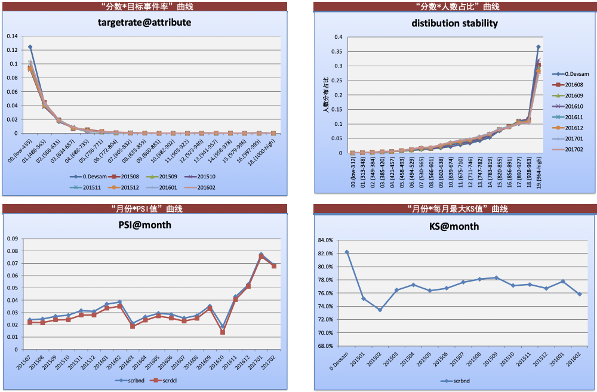
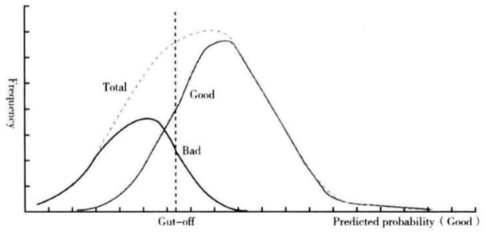
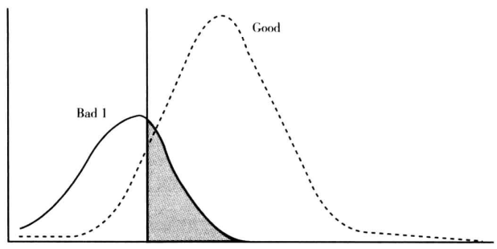
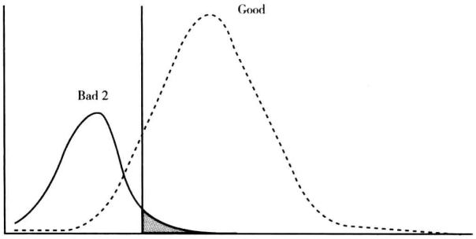

- [5.4.1 模型监控报表](#541-模型监控报表)
- [5.4.2 模型稳定性分析](#542-模型稳定性分析)
- [5.4.3 模型修正举措](#543-模型修正举措)

### 5.4.1 模型监控报表

其中模型监控，主要关注上线后各个月份“分数目标事件率”、“分数人数占比”、 “月份 $PSI$ 值”、“月份每月最大  $KS$ 值”曲线等，如下图：

示例中，截止到监控时点，分数对应目标事件率和人数占比各月份相对稳定， $KS$ 75.84高，区分能力好， $PSI$ 0.068较小，分数上客群分布稳定。

### 5.4.2 模型稳定性分析

首先，我们明确模型稳定性高是指模型的预测能力在时间维度上是一致的，即模型在测试集、时间外样本集、线上测试和正式使用的时候有近乎相同的区分度。

如果模型不稳定，一般是各种原因引起的好坏客户分布变化。如下好坏样本评分分布图：

好客户主要分布在高分区间，而坏客户主要分布在低分区间，两个分布交叉的地方表示模型无法有效区分的区域。

最好的模型是使得两类分布没有交叉，最坏的模型则是两类分布完全重合。中间垂直的虚线表示评分的阈值，高于阈值的为好客户，低于阈值的为坏客户。

因此，影响模型区分度的因素可以分为两个：

- 模型排序能力

即模型是否能够将两类客户的分布尽可能的分开，使得交叉部分足够小；

- 模型评分阈值

如何将两类样本分布的交叉区域进行划分；

那么，如果好坏客户分布变化，会有以下四种情况：

（1）坏客户的评分朝着高分段偏移而好客户的评分朝着低分段偏移。反映到实际的情况是全部客户的评分均值变小，且好客户和坏客户的评分均值之差也变小。

分析：这种变化是导致模型预测能力下降**最常见**和**最主要**原因。因为坏客户和好客户分布的交叉区域变大，意味着模型的排序能力降低，从而导致模型的区分度下降。风险模型发生这类变化的原因有可能是宏观经济恶化导致客户整体的还款能力下降，或者公司业务转型导致目标客户发生变化，或者公司业务团队在某段时间内集中某一类的客户过度营销，或者数据质量不稳定的原因。

（2）坏客户的评分朝着低分段偏移而好客户的评分朝着高分段偏移。反映到实际的情况是全部客户的评分均值变大，且好客户和坏客户的评分均值之差也变大。

分析：第二种变化的结果是改善型的，模型的区分度不仅没有下降，反而比以前更高了，实践中几乎不可能发生。

（3）坏客户和好客户的评分一起朝着高分段偏移；反映到实际的情况就是全部客户的评分均值变大，但好客户和坏客户的平分均值之差不变。

分析：这种变化相当于评分阈值的被动下调，从而导致提高了违约率，提升了通过率，但是模型的排序能力变化不大。

（4）坏客户和好客户的评分同时朝着低分段偏移；反映到实际的情况就是全部客户的评分均值变小，但好客户和坏客户的平均均值之差不变。

分析：这种变化相当于评分阈值的上调，从而降低了通过率和违约率，但是模型的排序能力变化不大。

### 5.4.3 模型修正举措

对于变化（2），我们无需做任何调整。对于变化（3）、（4），我们只需要相应调整评分阈值。但是对于变化（1），调整评分阈值无能为力，因为这是模型排序能力变化导致的。

此时，需分析导致好坏客户分布变化的原因：

-  业务变化，如行业变动、过度营销； 

-  特征变化，细化变量特征 $PSI$、 $CSI$，重新调整个别特征的分箱； 

> 上述部分内容摘自《3.4K字，让老板对你的模型稳定性不再质疑》
