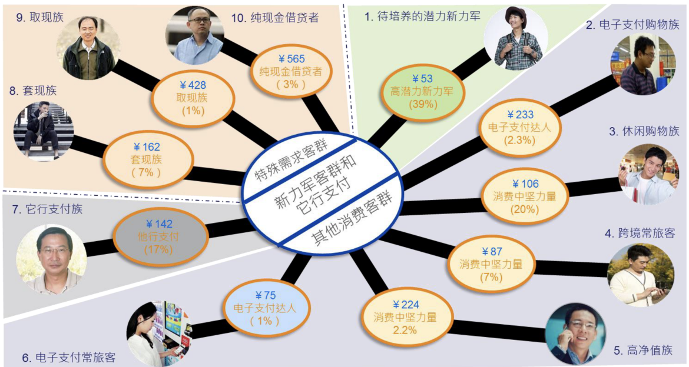

- [6.1.1 基础能力](#611-基础能力)
- [6.1.2 应用场景](#612-应用场景)
- [6.1.3 研发路线](#613-研发路线)
- [6.1.4 结果示例](#614-结果示例)

### 6.1.1 基础能力

> 客户细分是一种综合的分析方法，它本质上是由多种分析方法或分析手段综合在一起，解决客户细分问题。客户细分的目标，精确定位不同的需求的客户，将有限的营销资源进行合理的安排，以达到营销资源效率最大化。比如：对于最可能购买某类理财产品的客户，我们将有分配给最有经验的客户经理去跟踪营销，这样营销成功的概率会更大。客户细分是用科学的数据挖掘方法来提升各项业务目标的达成效率。

### 6.1.2 应用场景
以下主要列举客户运营应用场景，未包括风险贷前人工审批、欺诈监测等。

### 6.1.3 研发路线

### 6.1.4 结果示例
标签画像上，可以将消费客群划分为：

注：相关图片、数据仅为示例。

