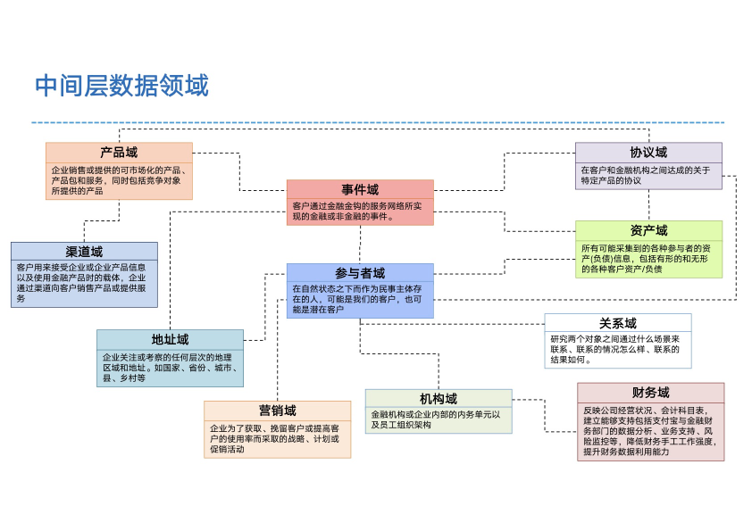

- [6.2.1 数据领域](#621-数据领域)
- [6.2.2 设计原则](#622-设计原则)

### 6.2.1 数据领域
涵盖产品、事件、协议、渠道、参与者、资产、地址、关系、营销、机构、财务等数据领域，如下：

### 6.2.2 设计原则
一般的，数据中间层逻辑包含两次DWD明细层和DWS汇总层，实际物理落地时，不超过6层，其中DWD不超过3层，DWS不超过3层，且逐层依赖。

- DWD层说明：
> 第一层DWD：视业务复杂程度确定是否需要，大部分情况不需要。
> 原则上只依赖ODS或者跨业务的DWD表。
>  
> 第二层DWD：紧贴业务场景的DWD表，没有跨业务整合。
> 原则上只依赖第一层DWD表或者跨业务的DWD表。
>  
> 第三层DWD：跨业务场景的整合多业务的DWD表。
> 原则上只依赖第二层DWD表或者跨业务的DWD表。

- DWS层说明：
> 第一层DWS表：视业务复杂程度确定是否需要，大部分情况不需要。
> 原则上只依赖DWD表。
>  
> 第二层DWS表：核心建设数据。
> 原则上只依赖DWD表，如果有多实体多维度汇总表，则必须规避使用DWD表，而使用第一层DWS表。
>  
> 第三层DWS表：主数据或者聚合多业务场景需要，比如自然人、用户资产全局表。

