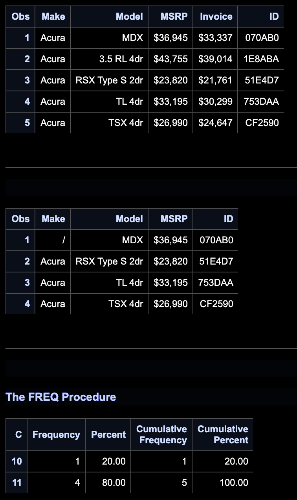
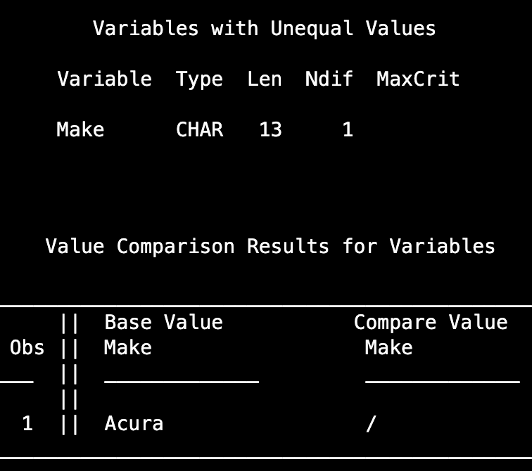

- [8.2.1 传统测试](#821-传统测试)
  - [8.2.1.1 常见问题](#8211-常见问题)
  - [8.2.1.2 SAS测试](#8212-sas测试)
- [8.2.2 专业测试](#822-专业测试)

一般策略上线前，会将线下策略复现，如数据仓库SQL跑批、SAS生产环节部署、上线至RTDM，这些时候就会有大量数据测试工作。
### 8.2.1 传统测试
#### 8.2.1.1 常见问题

- 特殊代码

由于不同代码本身特殊计算逻辑存在差异引发的错误，如SAS缺失计算。

- 计算精度

未约定或约定计算精度不一致时，如0.12与0.120000.

- 计算口径

在业务口径明确的情况下，对口径的理解或实现逻辑限制引发的计算口径存在差异。

- 错误计算

人为的不经意错误引发的错误计算。

#### 8.2.1.2 SAS测试
示例，构建CARS1、CARS2数据集，其中CARS2缺失字段INVOICE，并缺失一条数据。
通过`MERGE`、`COMPARE`进行数据测试：

```sas
DATA CARS1;
SET SASHELP.CARS(KEEP = MAKE MODEL MSRP INVOICE OBS=5);
ID = PUT(MD5(_N_), HEX6.);
RUN;
PROC SORT DATA = CARS1; BY ID; RUN;

DATA CARS2;
SET SASHELP.CARS(KEEP = MAKE MODEL MSRP OBS=4);
ID = PUT(MD5(_N_), HEX6.);
IF _N_ = 1 THEN MAKE = "/";
RUN;
PROC SORT DATA = CARS2; BY ID; RUN;

PROC PRINT DATA = CARS1;
RUN;

PROC PRINT DATA = CARS2;
RUN;

DATA CARS12;
MERGE CARS1(IN=A) CARS2(IN=B);
BY ID;
IF A OR B;
C = A * 10 + B;
RUN;

PROC FREQ DATA = CARS12;
TABLE C;
RUN;

PROC COMPARE BASE = CARS1 COMPARE = CARS2 CRITERION = 0.01;
VAR MAKE MODEL MSRP;
BY ID;
RUN;
```

输出结果如下：

<p align="center">

</p>

<p align="center">

</p>


### 8.2.2 专业测试
现在我们把这个问题专业化，因为行业上是有专门的测试工程师。
> 摘自《测试架构师修炼之道：从测试工程师到测试架构师》-微信读书


- 像软件测试架构师一样的思考

（1）测试的目标是什么？

（2）测试的范围是什么？

（3）测试的深度和广度是什么？

（4）测试的重点和难点是什么？

（5）如何安排测试？

（6）如何评估测试结果？

这些问题，可能就是一个思考过程，没有输出，但是只要你愿意去思考这些问题，就一定能为产品测试带来积极的效果，同时自己的测试水平，特别是对测试整体的控制力会大大加强。
