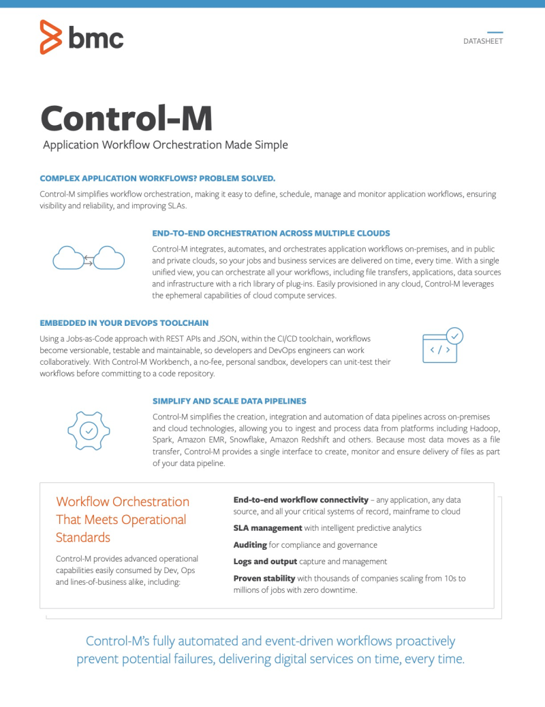
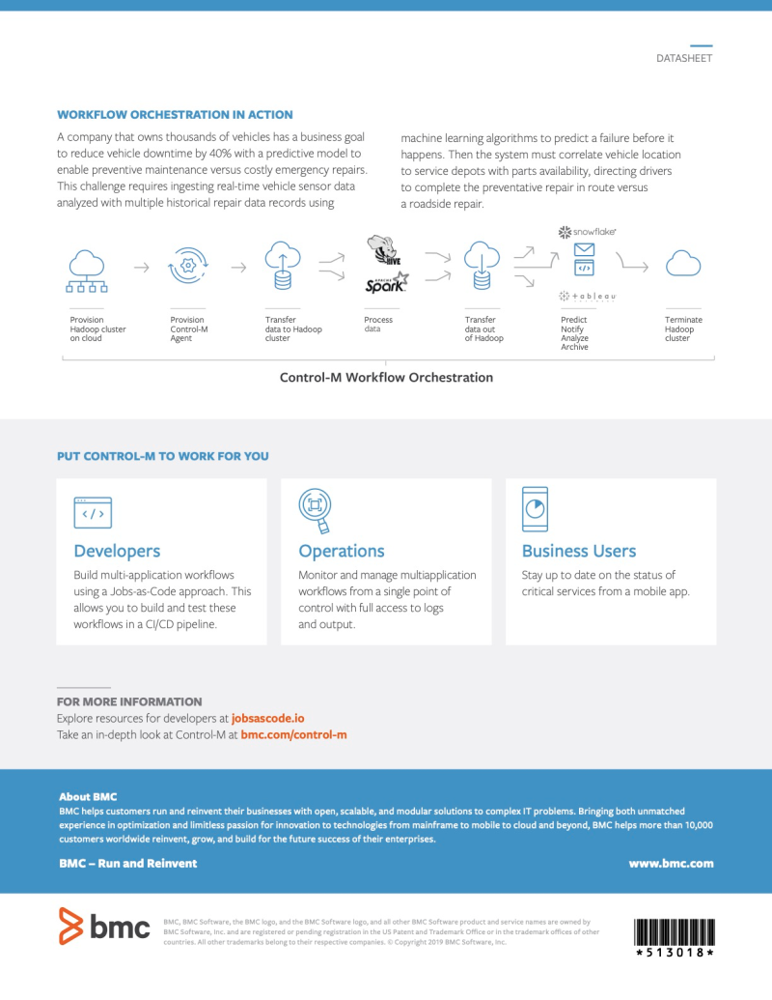
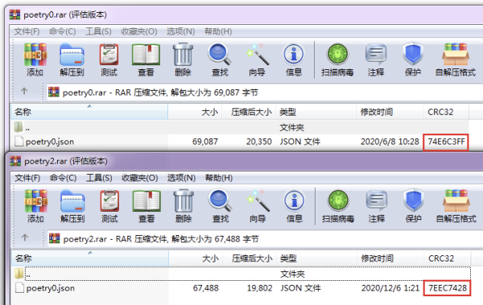

- [8.3.1 作业调度](#831-作业调度)
  - [8.3.1.1 数据探索环境](#8311-数据探索环境)
  - [8.3.1.2 数据生产环境](#8312-数据生产环境)
  - [8.3.1.3 作业监控](#8313-作业监控)
- [8.3.2 结果入仓](#832-结果入仓)
  - [8.3.2.1 需求调研](#8321-需求调研)
  - [8.3.2.2 数据校验](#8322-数据校验)
  - [8.3.2.3 结果生成](#8323-结果生成)

### 8.3.1 作业调度
#### 8.3.1.1 数据探索环境
数据探索环境迁移前后，先后使用以下两种作业调度模式：

（1）crontab

- crontab介绍

Linux自带简单调度工具crontab，类似于windows的任务计划程序。
基本语法：

```bash
crontab [-u user] { -e | -r | -l }
# -e : 执行文字编辑器来设定时程表，默认vi；
# -r : 删除目前的时程表；
# -l : 列出目前的时程表；
```

配置格式：

```bash
f1	f2	f3	f4	f5 program
*		*		*		*		*
-		-		-		-		-
|		|		|		|		|
|		|		|		|		+----- 星期中星期几, 0 - 7, 星期天为0
|		|		|		+---------- 月份, 1 - 12 
|		|		+--------------- 一个月中的第几天, 1 - 31
|		+-------------------- 小时, 0 - 23
+------------------------- 分钟, 0 - 59
# 当f1为*时表示每分钟都要执行program；
# 当f1为a-b时表示从第a分钟到第b分钟这段时间内要执行；
# 当f1为*/n时表示每n分钟个时间间隔执行一次；
# 当f1为a,b,c,...时表示第a,b,c,...分钟要执行；
# 其余同理。
```

- 具体作业配置

部署代码：
这里为方便部署，基于python构建自动化部署脚本，生成规范化代码结构，并自动部署至crontab。

```python
# -*-coding:utf-8-*-
# @auth ivan
# @time 20190812
# @goal config.py

# System Init
path = "/folders/myfolders/local/"
pname = "01.MAIN.sas"
pshell = "run.sh"
runsh = """export LANG="en_US.UTF-8"
"/data1/sas/SASHome/SASFoundation/9.4/sas" -sysin "@path@@pname@"
""".replace("@pname@", pname)

# System Func
ftr = lambda x: x.lstrip("\n")#.decode("gbk").encode("utf-8")


# Poject
name = "XXX"
title = """
/*
程序名称：@程序名称@
程序描述：@程序描述@
创建人员：@创建人员@
创建时间：@创建时间@
跑批频次：@跑批频次@
创建表格：@创建表格@
*/
""".replace("@程序名称@", "客户收益标签")\
.replace("@程序描述@", "计算客户收益，输出标签")\
.replace("@创建人员@", "Test")\
.replace("@创建时间@", "20200101")\
.replace("@跑批频次@", "每日")\
.replace("@创建表格@", "D_CUSTVALUE_YYYYMM，收益明细表")

libname = """
LIBNAME BSD "/data2/userhome/DEV-HOME/SAS-DEV-OUTBOUND-01/Data";
LIBNAME DM "/data2/userhome/DEV-HOME/SAS-DEV-OUTBOUND-01/DM";
"""

cpath = """
/* 项目所在路径 */
%LET MAINPATH = @PATH@;
/* 代码路径 */
%LET CODEPATH = &MAINPATH./code;
/* 日志路径 */
%LET LOGPATH = &MAINPATH./log;
"""

macro = """
/* 导入宏脚本 */
"""

mtime = """
/* 日期参数 */
%GLOBAL RUN_DATE ETL_DATE;
DATA _NULL_;
CALL SYMPUT("RUN_DATE", COMPRESS(PUT(TODAY(), YYMMDDN8.)));
CALL SYMPUT("ETL_DATE", COMPRESS(PUT(TODAY()-1, YYMMDDN8.)));
RUN;
%PUT &RUN_DATE. &ETL_DATE.;

"""

mcode = """
%MACRO AUTORUN();
DATA EXAMPLE;
A = 1;
RUN;
%MEND AUTORUN;

"""

mlogs = """
PROC PRINTTO LOG = "&LOGPATH./L_&ETL_DATE..log" NEW; RUN;
%AUTORUN();
PROC PRINTTO LOG = LOG; RUN;
"""

crontab = """9 9 * * * @path@run.sh >> /data2/userhome/DEV-HOME/SAS-DEV-OUTBOUND01/Log/@name@.log 2>&1""".replace("@name@", name)

name = ftr(name) 
title = ftr(title) 
libname = ftr(libname) 
cpath = ftr(cpath) 
macro = ftr(macro) 
mtime = ftr(mtime) 
mcode = ftr(mcode) 
mlogs = ftr(mlogs) 
crontab = ftr(crontab)
```

```python
# -*-coding:utf-8-*-
# @auth ivan
# @time 20190812
# @goal run.py

from config import *
import os

print("#00.init")
sep = os.path.sep
mpath = path + name + sep
mpath_code = mpath + "code" + sep
mpath_logs = mpath + "log" + sep

print("#01.make project dir")
if not os.path.isdir(mpath):
    os.mkdir(mpath)
    os.mkdir(mpath_code)
    os.mkdir(mpath_logs)
else:
    print("DIR ERROR")

print("#02.code init")
f = open(mpath_code + pname, "w")
f.write(title + "\n")
f.write("OPTIONS COMPRESS = YES;\n")
f.write(libname + "\n")
f.write(cpath.replace("@path@", mpath) + "\n")
f.write(macro)
f.write(mtime)
f.write(mcode)
f.write(mlogs)
f.close()

with open(mpath_code + pname, "r") as f:
    for i in f:
        print(i.strip("\n"))

print("#03.build run shell")
runsh = runsh.replace("@path@", mpath_code)
print(runsh)
with open(mpath_code + pshell, "w") as f:
    f.write(runsh)

print("#04.insert crontab")
cmd = crontab.replace("@path@", mpath_code)
print(cmd)
op = os.popen("crontab -l").read()
if cmd not in op:
    os.system("""(crontab -l|grep -v "@cmd@";echo "@cmd@")|crontab -""".replace("@cmd@", cmd))
else:
    print("crontab ERROR")

op = os.popen("crontab -l").read()
print(op)
```

生成代码：

- **01.MAIN.sas**

```sas
/*
程序名称：客户收益标签
程序描述：计算客户收益，输出标签
创建人员：Test
创建时间：20200101
跑批频次：每日
创建表格：D_CUSTVALUE_YYYYMM，收益明细表
*/

OPTIONS COMPRESS = YES;
LIBNAME BSD "/data2/userhome/DEV-HOME/SAS-DEV-OUTBOUND-01/Data";
LIBNAME DM "/data2/userhome/DEV-HOME/SAS-DEV-OUTBOUND-01/DM";

/* 项目所在路径 */
%LET MAINPATH = @PATH@;
/* 代码路径 */
%LET CODEPATH = &MAINPATH./code;
/* 日志路径 */
%LET LOGPATH = &MAINPATH./log;

/* 导入宏脚本 */
/* 日期参数 */
%GLOBAL RUN_DATE ETL_DATE;
DATA _NULL_;
CALL SYMPUT("RUN_DATE", COMPRESS(PUT(TODAY(), YYMMDDN8.)));
CALL SYMPUT("ETL_DATE", COMPRESS(PUT(TODAY()-1, YYMMDDN8.)));
RUN;
%PUT &RUN_DATE. &ETL_DATE.;

%MACRO AUTORUN();
DATA EXAMPLE;
A = 1;
RUN;
%MEND AUTORUN;

PROC PRINTTO LOG = "&LOGPATH./L_&ETL_DATE..log" NEW; RUN;
%AUTORUN();
PROC PRINTTO LOG = LOG; RUN;
```

- **run.sh**

```shell
export LANG="en_US.UTF-8"
"/data1/sas/SASHome/SASFoundation/9.4/sas" -sysin "/folders/myfolders/local/XXX/code/01.MAIN.sas"
```

（2）轮询作业

- 轮询作业介绍

基于ETL_CVM管理用户下，在job_etl_EveryDay.every_table表上配置代码路径、日志路径、运行时间等，后台部署作业每N频度轮询，将到点作业调起运行。

- 具体作业配置
> 调整为由调度工具向`run.sh`传入时间参数。


示例代码：

- **01.MAIN.sas**

```sas
/*
程序名称：客户收益标签
程序描述：计算客户收益，输出标签
创建人员：Test
创建时间：20200101
跑批频次：每日
创建表格：D_CUSTVALUE_YYYYMM，收益明细表
*/

OPTIONS COMPRESS = YES;
LIBNAME BSD "/data2/userhome/DEV-HOME/SAS-DEV-OUTBOUND-01/Data";
LIBNAME DM "/data2/userhome/DEV-HOME/SAS-DEV-OUTBOUND-01/DM";

/* 项目所在路径 */
%LET MAINPATH = @PATH@;
/* 代码路径 */
%LET CODEPATH = &MAINPATH./code;
/* 日志路径 */
%LET LOGPATH = &MAINPATH./log;

/* 导入宏脚本 */
/* 日期参数 */
%LET NDAY = 1;
DATA _NULL_;
CALL SYMPUT("ETLD", INPUT(COMPRESS("&SYSPARM."), YYMMDD8.)-&NDAY.);
RUN;
DATA _NULL_;
CALL SYMPUT("ETLN", PUT(&ETLD., YYMMDDN8.));
RUN;
%PUT &ETLD. &ETLN.;

%MACRO AUTORUN();
DATA EXAMPLE;
A = 1;
RUN;
%MEND AUTORUN;

PROC PRINTTO LOG = "&LOGPATH./L_&ETLN..log" NEW; RUN;
%AUTORUN();
PROC PRINTTO LOG = LOG; RUN;
```

- **run.sh**

```shell
dt=$(date '+%Y%m%d')echo "Time:"$dt",Para1:"$1",END"

sashome="/data1/sas/SASHome/SASFoundation/9.4/sas"
sasfile="/data2/userhome/DEV-HOME/SAS-DEV-OUTBOUND-01/Project/Proj_basedata/code/run.sas"

if [ ! $1 ];then 
    saspara="$dt"
else
    saspara="$1"
fi

function vaild_date {
    tt='data -d "$1"'
    return $?
}

vaild_date $saspara
vaild=$?

if [ $vaild -eq 0 ];then
    cmd="$sashome -sysin $sasfile -sysparm $saspara -nolog"
    echo $cmd
    $cmd
fi 
echo END
```

#### 8.3.1.2 数据生产环境
数据生产环境统一使用行内数仓配置的Control-M。
（1）Control-M

- Control-M介绍

Control-M是BMC Software提供的企业级集中作业调度管理解决方案，它集中地管理跨平台、跨应用的生产控制和调度过程，该解决方案的核心功能是：按照业务逻辑自动调度和提交相关作业；实时监控和分析作业运行状态和运行结果； 基于运行结果自动进行作业的后续处理。

<p align="center">

</p>

<p align="center">

</p>


- 具体作业配置

示例代码：
> 在轮询作业版本上调整错误返回，用于**Control-M**抓取作业状态。


- **01.MAIN.sas**

同上轮询作业版本。

- **run.sh**

```shell
export LANG="en_US.UTF-8"

run(){
    sashome="/data1/sas/SASHome/SASFoundation/9.4/sas"
    sasfile="/data2/userhome/DEV-HOME/SAS-DEV-OUTBOUND-01/Project/Proj_basedata/code/run.sas"
    
    dt=$(date '+%Y%m%d')
    
    if [ ! $1 ];then 
        saspara="$dt"
    else
        saspara="$1"
    fi
    
    function vaild_date {
        tt='data -d "$1"'
        return $?
    }
    
    vaild_date $saspara
    vaild=$?

    if [ $vaild -eq 0 ];then
        cmd="$sashome -sysin $sasfile -sysparm $saspara -nolog"
        echo $cmd
        $cmd
    else 
        exit 1
    fi

    if [ $? -eq 2 ];then
        exit 2
    else 
        exit 0
    fi

}

run
```

#### 8.3.1.3 作业监控
通过以下机制，保障作业部署后实际跑批情况：

- 日志工具

（1）SAS作业：通过`PROC PRINTTO LOG`实现；
（2）Python作业：通过`import logging`、`try-except`实现；

- 错误检索

（1）SAS作业：通过检索日志文件Note、Warning、ERROR（关键词为：`ERROR:`）；
（2）Python作业：封装至shell，检索返回结果等；

- 异常报警

有条件时，可将日志报错报警通过短信发送，或Web页面红色报警，方便运维人员第一时间知晓。

- 异常原因

```
原始数据延迟；
系统接口错误；
系统时间修改；
服务器超负载；
调度依赖异常；
人为不当操作；
代码存在漏洞；
异常报警有误；
```

系统稳定运作其实靠各种假设支撑，并且环环相扣。理论上假设均合理，不存在任何问题。但每当某一个假设失效，如系统时间被意外重置至2000.01.01时，虽说发生概率很低，但一旦发生，任何与时间相关的业务机制都将崩塌，如定时传输、账单跑批。这就需要定期对业务流程、数据流程的风险点进行排查、优化。

### 8.3.2 结果入仓
#### 8.3.2.1 需求调研
一般的，数据入仓前会填写来自如下入仓需求调研，以营销灰名单库作业为例：

（1）文件传输

- IP地址

文件服务器的IP？～XXX.XXX.XXX.XXX；

- 用户名

登陆服务器的用户名？～XXX；

- 密码

登陆服务器的密码？～XXXXXX；

- 文件路径

文本文件存放路径？～/data2/sas/share/output/；

- 文件准备就绪时间

数据生成的具体时间，例：自然日20190902凌晨01:00生成20190901的数据？～自然日20190902凌晨01:00生成20190901的数据；

- 频度及日期

入仓表是按日入仓，还是按月入仓？～按日入仓；

- 文件名

文件入仓对应的文件名，包括文件后缀，例：S24_CCS_CARD_20190101.txt？～DX_BlackCustrList_20200101.txt；

- 字段分隔符

文件中的字段间的分隔符，例：｜？～｜；

- 行间分隔符

文件每行之间分隔符，例：lf：换行、cr：回车？～CRLF；

- 字符编码

UTF-8/GB18030？～UTF-8；

- 如果当日没有发生数据，是否可生成空文件传送

若上游T日无数据发生，必须空文件传输，保证程序自动化稳定性？～可以；

- 数据文件提供方式：增/全量

增量：今天只入今天新增数据，全量：每天一个从历史到现在的全部数据？～增量；

- 每日增量及全量的数据量

了解数据量大致情况，有利于了解和把握入仓对上下游的性能影响？～10W；

- 是否需要做初始化，如需初始化，需要具体初始化时间

是否需要追历史数据，如文件入仓，需备注初始化文件大小，如连库入仓，需提供规则？～不需要；

（2）数据描述

- 数据提供方系统名称

例：发卡系统-CCS？～SAS生产服务器；

- 表存储方式（流水表、快照表）

流水表，比如历史流水表，每日的业务数据，都会有一个业务时间区分；全量数据是每日数据的堆加；快照表：比如客户信息表，全量数据是所有客户截止到当前最新状态的数据？～流水表；

- 是否对历史数据进行更新操作

例：当日是否会对历史的数据进行更新操作，更新后的数据是否会更新时间戳，或者以新的文件推送？～是；

- 是否对历史数据进行删除操作

例：当日是否会对历史的数据进行删除操作，更新后的数据是否会更新时间戳，或者以新的文件推送？～否；

- 若有以上操作，更新频度如何？是否由业务随机触发？

如有更新、删除操作，频度如何：频繁/缓慢？～频繁，每日；

- 上游变更流程

若上游系统发生变更（数据变更、表结构变更），对应表更流程？例：变更上线前，由业务或科技人员邮件通知？～无；

- 提供接口文档/数据字典

用于记录描述表结构，包括表中英文名、字段中英文名、字段类型和长度；～已提供；

- 主键字段

主键用于校验数据唯一性？～ID；

- 业务主键字段

是否存在业务主键，即从业务角度确认最细粒度的字段？～ID、IDType；

- 时间戳字段

时间戳用于了解数据发生日期？～ETL_DATE；

- 其他

上述未提及或其他要求？～无；

#### 8.3.2.2 数据校验
想象一下，当数据入仓时获取到的数据文本文件大小、行数比平时明显少。我们可以猜想是否输出时因程序中断或导出异常引起的数据缺失？或者事实如此并无异常？这样猜想自然没有问题，但是我们无从证明，需要人工联系数据上游进行排查。
故而我们引入数据校验，约定传输数据文本文件的同时，另附数据校验文件，格式如：

```python
# 文件名，大小，行数
poetry0.json，69087, 2038
```

这样每次入仓前都进行大小、行数验证，就能很好地解决了上述问题。
另外，数据校验在繁杂人工数据操作流程也能起到作用，如调额短信文件，在`生成—传输—下发—...—入仓`流程中，数据校验可检查因人工刻意修改或错误操作引起的数据文本不一致。如例：
对poetry0.json未作任何修改，先后压缩两个压缩包，可见CRC32码`74E6C3FF`一致。

<p align="center">

</p>

修改poetry0.json并重新压缩，与原压缩包对比，CRC32码自`74E6C3FF`变化为`7EEC7428`。

<p align="center">

</p>

那么，用此方法检查调额短信文件，可保障完整流程下数据文件始终保持一致。
上例文件修改时间、修改大小改动明显，但当修改时间、修改大小非常接近时，CRC32仍能起到很好的作用，这是人工检验比较难以发现的。
> CRC32 
> CRC（Cyclic Redundancy Check）校验实用程序库在数据存储和数据通讯领域，为了保证数据的正确，就不得不采用检错的手段。在诸多检错手段中，CRC是最著名的一种。CRC的全称是循环冗余校验。检错能力极强，开销小，易于用编码器及检测电路实现。从其检错能力来看，它所不能发现的错误的几率仅为0.0047%以下。从性能上和开销上考虑，均远远优于奇偶校验及算术和校验等方式。因而，在数据存储和数据通讯领域，CRC无处不在：著名的通讯协议X.25的FCS（帧检错序列）采用的是CRC-CCITT，ARJ、LHA等压缩工具软件采用的是CRC32，磁盘驱动器的读写采用了CRC16。


#### 8.3.2.3 结果生成
SAS作业可通过以下语句：

```sas
# 空表示例
%LET ETLD = 20210101;

%MACRO OUT_FILE1(FILENAME=, OUTFILE=);
	FILENAME &OUTFILE. FTP &FILENAME.
		CD = "/XXX/XXX/XXX/"
		USER = "XXX"
		PASS = "XXXXXX"
		HOST = "XXX.XXX.XXX.XXX"
	PROMPT;
%MEND OUT_FILE;

%MACRO OUT_FILE2(FILENAME=, OUTFILE=);
	FILENAME &OUTFILE. "/data2/sas/share/output/&FILENAME.";
%MEND OUT_FILE;

DATA BLIST;
FORMAT ID $8. IDType $100. ETL_DATE 8.;
KEEP ID IDType ETL_DATE;
STOP;
RUN;

%OUT_FILE2(FILENAME=DX_BlackCustrList_&ETLD..txt, OUTFILE=EXPT);

DATA _NULL_;
SET BLIST;
FILE EXPT LRECL=32767 DLM="|" ENCODING="UTF-8" TERMSTR=CRLF;
PUT
	ID IDType ETL_DATE
;
RUN;
```


